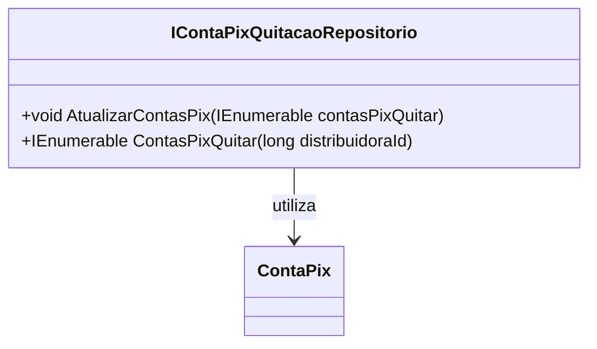

# IContaPixQuitacaoRepositorio
**Namespace**: IsthmusWinthor.Dominio.Interfaces  
**Nome do Arquivo**: IContaPixQuitacaoRepositorio.cs  

## Visão Geral e Responsabilidade
A interface `IContaPixQuitacaoRepositorio` representa um contrato para a implementação de repositórios que manipulam a lógica de quitação de contas Pix. Esta interface é crucial para a gestão e a operações de quitação de contas dentro do sistema, permitindo que diferentes implementações alcancem a persistência e recuperação de dados relacionados às contas Pix que precisam ser quitadas.

## Métodos de Negócio

### 1. AtualizarContasPix
- **Título**: AtualizarContasPix - `void`
- **Objetivo**: Assegura que as contas Pix listadas sejam atualizadas adequadamente no sistema, refletindo seu estado de quitação.
- **Comportamento**: 
  1. Recebe uma coleção de objetos `ContaPix`.
  2. Itera sobre cada `ContaPix` na coleção.
  3. Para cada conta, realiza a atualização necessária no armazenamento de dados.
  4. Confirma que todas as contas foram processadas sem erros.
- **Retorno**: Não retorna valor; o sucesso da operação é indicado pela ausência de exceções.

### 2. ContasPixQuitar
- **Título**: ContasPixQuitar - `IEnumerable<ContaPix>`
- **Objetivo**: Recupera todas as contas Pix que precisam ser quitadas, filtradas por um identificador de distribuidora específico.
- **Comportamento**: 
  1. Recebe um `distribuidoraId` como parâmetro.
  2. Consulta o armazenamento de dados para encontrar todas as contas Pix associadas à distribuidora indicada.
  3. Retorna uma coleção de contas Pix que necessitam de quitação.
- **Retorno**: Retorna uma coleção de `ContaPix` que estão pendentes para quitação.

## Tipos Auxiliares e Dependências
- **Classes de domínio utilizadas**:
  - [ContaPix](ContaPix.md)

## Diagrama de Relacionamentos

---
Gerada em 29/12/2025 21:15:39
