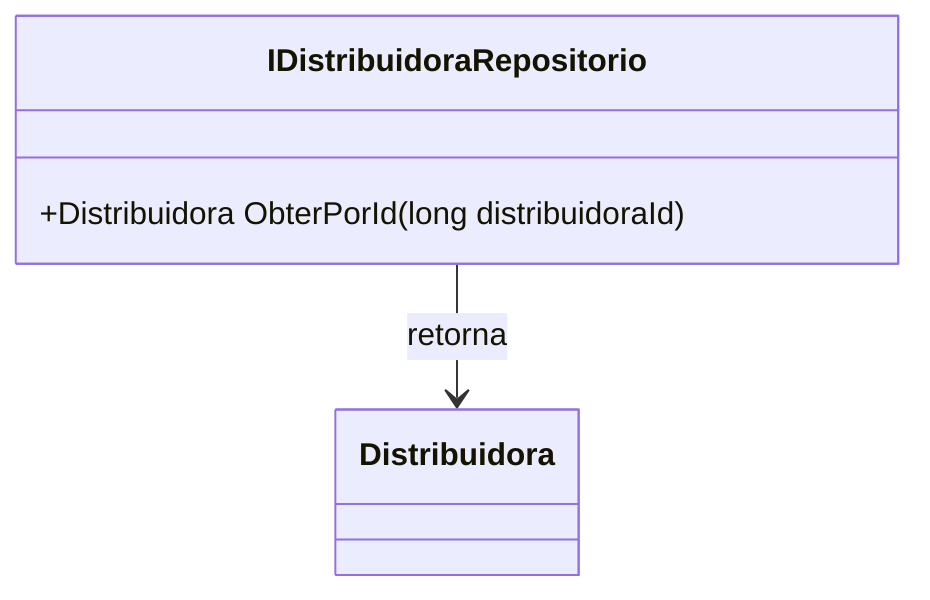

# IDistribuidoraRepositorio
**Namespace**: IsthmusWinthor.Dominio.Interfaces  
**Nome do Arquivo**: IDistribuidoraRepositorio.cs

> `IDistribuidoraRepositorio` é uma interface responsável por definir as operações relacionadas ao acesso e manipulação de dados da entidade `Distribuidora`.

## Métodos de Negócio

### Título: ObterPorId (Público)
- **Objetivo**: Garantir que a aplicação possa recuperar uma instância de `Distribuidora` a partir de seu identificador único.
  
- **Comportamento**: 
  1. O método aceita um parâmetro do tipo `long` que representa o `distribuidoraId`.
  2. Internamente, o método deve realizar uma consulta no repositório para localizar uma `Distribuidora` que corresponda ao ID fornecido.
  3. Se a `Distribuidora` for encontrada, ela é retornada. Caso contrário, o retorno pode ser nulo ou uma exceção pode ser lançada, dependendo da implementação.

- **Retorno**: Retorna uma instância de `Distribuidora` correspondente ao `distribuidoraId`, ou `null` caso não exista.

## Tipos Auxiliares e Dependências
- A interface utiliza a classe `Distribuidora`, que deve ser detalhada em seu próprio documento: [Distribuidora](Distribuidora.md).

## Diagrama de Relacionamentos

---
Gerada em 29/12/2025 21:15:47
