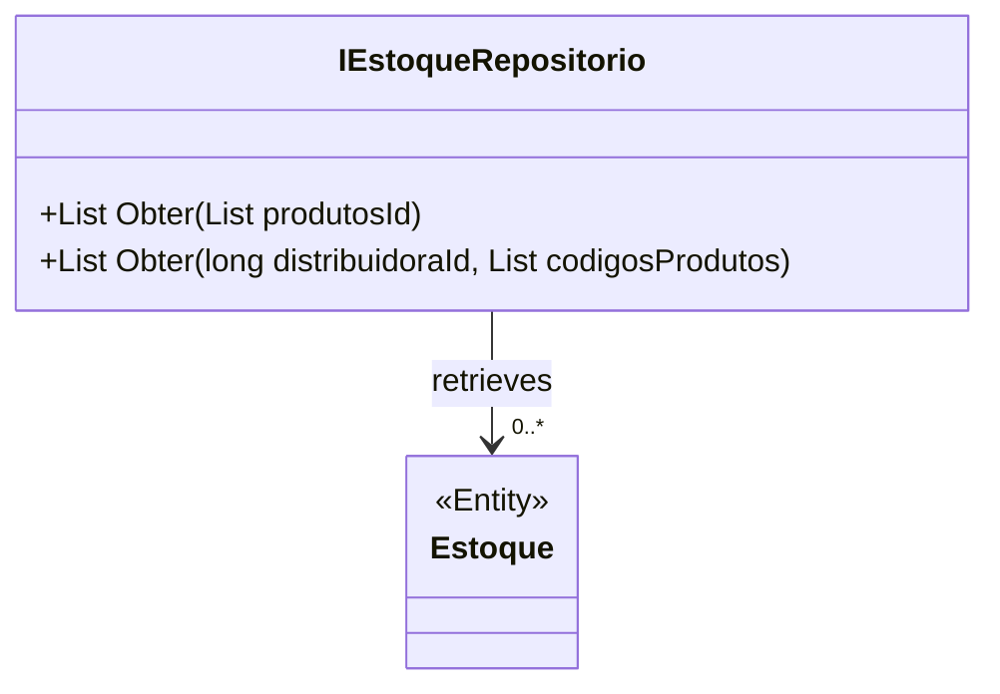

# IEstoqueRepositorio

**Namespace**: IsthmusWinthor.Dominio.Interfaces  
**Nome do Arquivo**: IEstoqueRepositorio.cs  

## Visão Geral e Responsabilidade
A interface `IEstoqueRepositorio` define um contrato para operações relacionadas ao acesso e recuperação de informações de estoque. Seu papel é fornecer métodos que garantam a integridade e a eficiência na consulta de estoque disponível para produtos específicos em diferentes distribuidoras. Ela aborda o problema de negócio de acesso a dados, permitindo que outros componentes da aplicação consultem o estado de estoque de forma organizada.

## Métodos de Negócio

### Obter (List<long>)
- **Objetivo**: Este método assegura que é possível recuperar uma lista de objetos `Estoque` baseada em uma lista de IDs de produtos, garantindo o acesso a informações pertinentes sobre a disponibilidade dos produtos solicitados.
- **Comportamento**: 
  1. Recebe uma lista de IDs de produtos.
  2. Consulta a base de dados ou armazenamento subjacente para encontrar os estoques correspondentes a esses IDs.
  3. Retorna uma lista de objetos `Estoque`, que contém informações sobre a quantidade e o estado de cada produto solicitado.
- **Retorno**: Retorna uma lista de `Estoque`, representando o estado atual dos produtos especificados.

### Obter (long, List<long>)
- **Objetivo**: Este método garante a recuperação dos estoques de produtos associados a uma distribuidora específica, permitindo consultas filtradas para gerenciar eficientemente o estoque conforme a localização ou distribuidora.
- **Comportamento**:
  1. Recebe um ID de distribuidora e uma lista de códigos de produtos.
  2. Realiza a consulta na base de dados ou sistema de armazenamento para encontrar as informações de estoque associadas à distribuidora para os produtos fornecidos.
  3. Retorna uma lista de objetos `Estoque` contendo a quantidade disponível e outros estados relevantes dos produtos.
- **Retorno**: Retorna uma lista de `Estoque`, indicando a disponibilidade dos produtos sob a distribuidora especificada.

## Tipos Auxiliares e Dependências
- Nenhum enumerador ou classe auxiliar foi identificado como dependência direta para a interface `IEstoqueRepositorio`. O foco está nas definições de métodos com a classe `Estoque`.

## Diagrama de Relacionamentos

Esta documentação reflete as regras de negócio e a organização da interface `IEstoqueRepositorio`, focalizando a integridade de dados para acesso ao estoque em um sistema corporativo.
