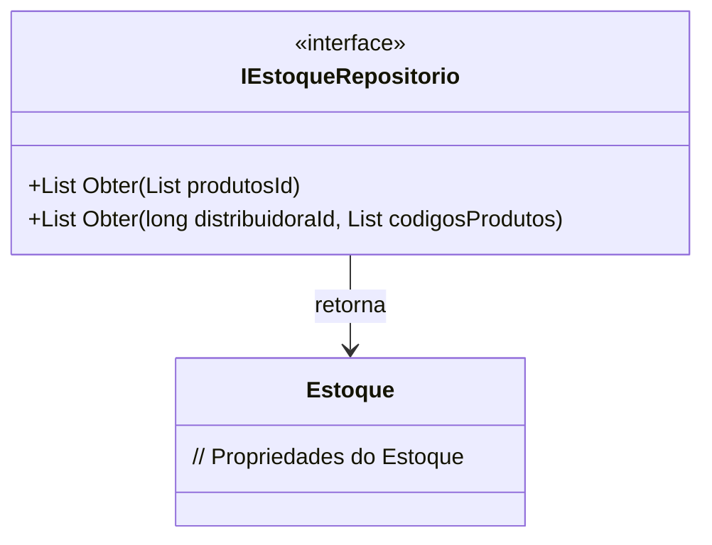

# IEstoqueRepositorio
**Namespace**: IsthmusWinthor.Dominio.Interfaces  
**Nome do Arquivo**: IEstoqueRepositorio.cs  

## Visão Geral e Responsabilidade
A interface `IEstoqueRepositorio` atua como um contrato para operações de acesso a dados relacionadas ao estoque no contexto de um sistema de gestão de distribuição. Seu papel é garantir que as implementações possam recuperar informações sobre os produtos disponíveis em diferentes distribuidoras. Isso ajuda a manter a integridade dos dados relacionados ao estoque e facilita a manipulação de informações cruciais para a operação de um armazém ou distribuição.

## Métodos de Negócio

### Título: Obter(List<long> produtosId) - Visibilidade: Public
- **Objetivo**: Este método garante que seja possível obter informações do estoque para uma lista específica de produtos.
- **Comportamento**: 
  1. Recebe uma lista de identificadores dos produtos (`produtosId`).
  2. A implementação deve consultar a fonte de dados (ex: banco de dados) para buscar as informações dos estoques correspondentes a esses produtos.
  3. Retorna uma lista de objetos `Estoque` que contém os dados dos estoques encontrados.
- **Retorno**: Uma lista de objetos `Estoque`, representando os produtos solicitados.

### Título: Obter(long distribuidoraId, List<long> codigosProdutos) - Visibilidade: Public
- **Objetivo**: Permite buscar informações de estoque em uma distribuidora específica com base em uma lista de códigos de produtos.
- **Comportamento**:
  1. Recebe um identificador da distribuidora (`distribuidoraId`) e uma lista de códigos de produtos (`codigosProdutos`).
  2. A implementação deve realizar uma consulta à fonte de dados, filtrando os estoques pela distribuidora e pelos códigos fornecidos.
  3. Retorna uma lista de objetos `Estoque` contendo os dados relativos aos produtos requisitados na distribuidora especificada.
- **Retorno**: Uma lista de objetos `Estoque` que corresponde à distribuição específica e aos códigos de produtos solicitados.

## Navigations Property
- Não existem Navigations Properties na interface `IEstoqueRepositorio`, pois ela atua apenas como um contrato de acesso a dados.

## Tipos Auxiliares e Dependências
- Classe Dependente: [Estoque](Estoque.md) - Necessária para representar o modelo de dados do estoque.

## Diagrama de Relacionamentos

---
Gerada em 29/12/2025 21:15:59
