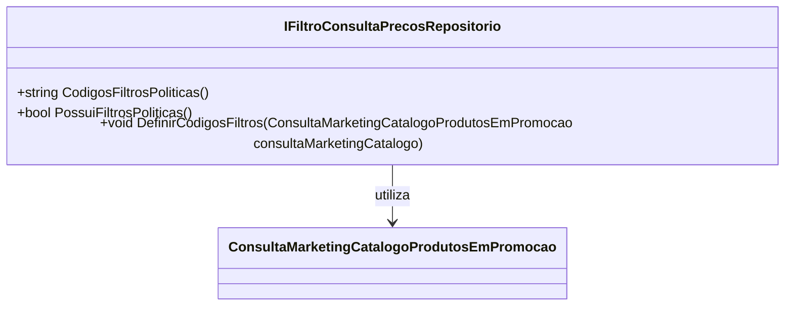

# IFiltroConsultaPrecosRepositorio
**Namespace**: IsthmusWinthor.Dominio.Interfaces  
**Nome do Arquivo**: IFiltroConsultaPrecosRepositorio.cs  

Esta interface é utilizada para definir metodologias de acesso e manipulação de filtros de consulta de preços dentro do sistema, facilitando a integração e a implementação de diferentes estratégias de consulta.

## Métodos de Negócio

### 1. CodigosFiltrosPoliticas
- **Título**: CodigosFiltrosPoliticas e Visibilidade: `public`
- **Objetivo**: Este método garante que o sistema possa recuperar os códigos dos filtros de políticas aplicadas nas consultas.
- **Comportamento**:
  1. O método deve se conectar ao repositório de dados.
  2. Ele irá buscar e retornar os códigos já definidos para as políticas de filtro.
  3. O retorno deve ser uma string com os códigos. 
- **Retorno**: Retorna uma string representando os códigos aplicados às políticas de filtro.

### 2. PossuiFiltrosPoliticas
- **Título**: PossuiFiltrosPoliticas e Visibilidade: `public`
- **Objetivo**: Verificar se existem filtros de políticas configurados no sistema.
- **Comportamento**:
  1. O método consulta o repositório para verificar a existência de filtros configurados.
  2. Retorna verdadeiro se pelo menos um filtro estiver definido; caso contrário, retorna falso.
- **Retorno**: Um booleano que indica a presença de filtros de políticas.

### 3. DefinirCodigosFiltros
- **Título**: DefinirCodigosFiltros e Visibilidade: `public`
- **Objetivo**: Permitir a definição ou atualização dos códigos dos filtros de consulta a partir de um objeto que contém as instruções para a configuração.
- **Comportamento**:
  1. Recebe um objeto do tipo `ConsultaMarketingCatalogoProdutosEmPromocao`.
  2. Extrai os códigos de filtro do objeto e os armazena no repositório de filtros.
  3. Pode envolver validações para garantir que os códigos não sejam duplicados ou inválidos.
- **Retorno**: O método não retorna um valor, mas deve ser considerado de efeito colateral, pois altera o estado do repositório.

## Propriedades Calculadas e de Validação
- Não aplicável: Esta interface não contém propriedades calculadas ou de validação.

## Navigations Property
- Não aplicável: Esta interface não define propriedades de navegação.

## Tipos Auxiliares e Dependências
- [ConsultaMarketingCatalogoProdutosEmPromocao](ConsultaMarketingCatalogoProdutosEmPromocao.md)

## Diagrama de Relacionamentos

Essa documentação fornece um entendimento claro dos métodos disponíveis na interface `IFiltroConsultaPrecosRepositorio`, suas responsabilidades e como se relacionam com outras partes do sistema.
---
Gerada em 29/12/2025 21:16:13
