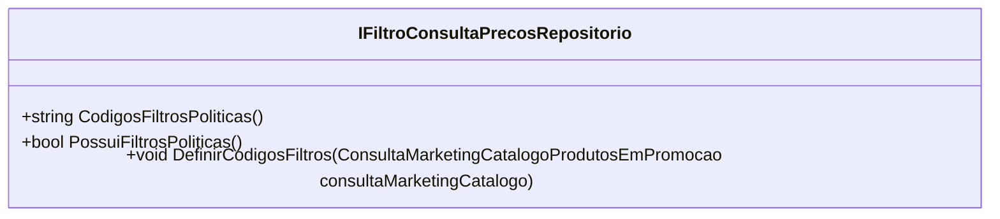

# IFiltroConsultaPrecosRepositorio
**Namespace**: IsthmusWinthor.Dominio.Interfaces  
**Nome do Arquivo**: IFiltroConsultaPrecosRepositorio.cs  

Este é um contrato que define a interface para o repositório responsável pela filtragem de preços, sinalizando a presença e a definição de códigos de filtros de políticas de promoção.

## Métodos de Negócio

### 1. `CodigosFiltrosPoliticas` (Visibilidade: `public`)
- **Objetivo**: Retornar os códigos relacionados aos filtros de políticas disponíveis para consulta de preços.
- **Comportamento**: Este método deve acessar a fonte de dados e extrair uma lista de códigos que representam filtros de políticas aplicáveis. Ele fornece uma forma de consulta que pode ser utilizada para personalizar a exibição de preços com base em critérios definidos.
- **Retorno**: Retorna uma string que contém os códigos dos filtros, que podem ser utilizados em outros processos de negócio.

### 2. `PossuiFiltrosPoliticas` (Visibilidade: `public`)
- **Objetivo**: Verificar se existem filtros de políticas disponíveis.
- **Comportamento**: Este método consulta a fonte de dados e verifica a presença de filtros de políticas. A lógica interna deve considerar todos os filtros que ainda estão ativos e disponíveis para utilização.
- **Retorno**: Retorna um valor booleano que indica a presença (`true`) ou a ausência (`false`) de filtros de políticas.

### 3. `DefinirCodigosFiltros` (Visibilidade: `public`)
- **Objetivo**: Definir os códigos de filtros a partir de uma consulta de marketing de catálogo de produtos em promoção.
- **Comportamento**: Este método aceita um objeto do tipo `ConsultaMarketingCatalogoProdutosEmPromocao` como parâmetro. Ele deve processar a consulta e extrair os códigos relevantes para os filtros de políticas, armazenando-os adequadamente para futuras consultas.
- **Retorno**: Este método não retorna valor, sua função é primariamente de efeito colateral, alterando o estado do repositório com os códigos fornecidos.

## Tipos Auxiliares e Dependências
- Nenhum tipo auxiliar ou enum foi identificado como utilizado dentro dessa interface.

## Diagrama de Relacionamentos

