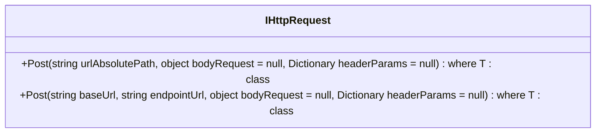

# IHttpRequest

**Namespace**: IsthmusWinthor.Dominio.Interfaces  
**Nome do Arquivo**: IHttpRequest.cs

A interface `IHttpRequest` defini métodos para realizar requisições HTTP, oferecendo uma maneira de estruturar chamadas para serviços web dentro do domínio da aplicação. Seu papel é facilitar a comunicação com APIs externas, permitindo o envio de dados e recepção de respostas de maneira robusta e coesa.

## Métodos de Negócio

### T Post<T>(string urlAbsolutePath, object bodyRequest = null, Dictionary<string, string> headerParams = null) where T : class
- **Objetivo**: Este método garante a capacidade de enviar dados para um serviço web especificado pelo `urlAbsolutePath`, retornando um objeto do tipo T como resposta.
- **Comportamento**:
  1. Recebe a URL absoluta do serviço para o qual a requisição será enviada.
  2. Permite a inclusão de um corpo de requisição (`bodyRequest`), que pode ser nulo.
  3. Permite a inclusão de parâmetros de cabeçalho (`headerParams`), que também podem ser nulos.
  4. Envia a requisição POST e processa a resposta.
  5. Retorna a resposta como um objeto do tipo T.
- **Retorno**: Retorna um objeto do tipo T representando a resposta da requisição HTTP. Se ocorrer algum erro, o tratamento e retorno depende da implementação específica.

### T Post<T>(string baseUrl, string endpointUrl, object bodyRequest = null, Dictionary<string, string> headerParams = null) where T : class
- **Objetivo**: Semelhante ao método anterior, este garante a invocação de um endpoint específico, construindo a URL combinando `baseUrl` e `endpointUrl`.
- **Comportamento**:
  1. Recebe uma URL base e um endpoint para formar a URL completa.
  2. Permite a inclusão de um corpo de requisição (`bodyRequest`), que pode ser nulo.
  3. Permite a inclusão de parâmetros de cabeçalho (`headerParams`), que também podem ser nulos.
  4. Envia a requisição POST para a URL combinada.
  5. Retorna a resposta como um objeto do tipo T.
- **Retorno**: Retorna um objeto do tipo T que representa a resposta da requisição HTTP. Assim como no primeiro método, o resultado pode variar conforme a implementação.

## Propriedades Calculadas e de Validação
Não há propriedades calculadas ou de validação na interface `IHttpRequest`.

## Navigations Property
Não há propriedades que são classes complexas do domínio nesta interface.

## Tipos Auxiliares e Dependências
- Não há enumeradores ou classes auxiliares que a interface `IHttpRequest` utiliza diretamente, dado que enfatiza apenas as operações de requisição.

## Diagrama de Relacionamentos

---
Gerada em 29/12/2025 21:16:27
