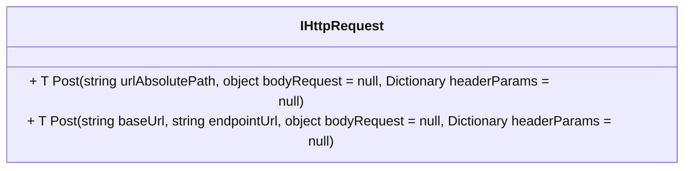

# IHttpRequest

- **Namespace**: IsthmusWinthor.Dominio.Interfaces
- **Nome do Arquivo**: IHttpRequest.cs

## Visão Geral e Responsabilidade
A interface `IHttpRequest` atua como um contrato para classes que realizam requisições HTTP em um contexto corporativo. Ela permite a abstração das operações de envio de requisições POST, facilitando a comunicação com APIs externas ou microserviços. A sua principal função é garantir que as implementações forneçam um meio consistente e seguro de enviar dados e receber respostas, promovendo a interoperabilidade em um ambiente distribuído.

## Métodos de Negócio

### Título: `Post<T>(string urlAbsolutePath, object bodyRequest = null, Dictionary<string, string> headerParams = null)` - **Público**
- **Objetivo:** Garantir que uma requisição HTTP POST seja realizada para a URL fornecida, enviando um corpo de solicitação opcional e cabeçalhos que possam ser necessários.
- **Comportamento:**
  1. Recebe a URL absoluta para a qual a requisição deve ser feita.
  2. Prepara o corpo da requisição se um `bodyRequest` for fornecido.
  3. Inclui cabeçalhos adicionais se especificados pelo `headerParams`.
  4. Executa a requisição POST e aguarda a resposta.
  5. Retorna a resposta de forma deserializada no tipo especificado.

- **Retorno:** Um objeto do tipo `<T>` que representa o resultado da operação, que pode ser um modelo de dados ou uma confirmação da operação.

### Título: `Post<T>(string baseUrl, string endpointUrl, object bodyRequest = null, Dictionary<string, string> headerParams = null)` - **Público**
- **Objetivo:** Garantir a execução de uma requisição HTTP POST com uma base URL e um endpoint especificado, possibilitando flexibilidade no direcionamento de requisições.
- **Comportamento:**
  1. Constrói a URL completa combinando a `baseUrl` com o `endpointUrl`.
  2. Prepara o corpo da requisição conforme o `bodyRequest`.
  3. Adiciona cabeçalhos necessários de acordo com o que foi passado em `headerParams`.
  4. Realiza a requisição POST e processa a resposta recebida.
  5. Retorna o resultado da operação em um formato deserializado.

- **Retorno:** Um objeto do tipo `<T>` que representa o resultado ou o estado da operação realizada.

## Propriedades Calculadas e de Validação
- A interface `IHttpRequest` não possui propriedades suspensas com lógica de validação ou cálculo.

## Navigations Property
- Não existem propriedades de navegação complexas na interface `IHttpRequest`.

## Tipos Auxiliares e Dependências
- **Nenhum tipo auxiliar ou dependência** Como a interface não possui enumerações ou classes estáticas associadas, não é necessário citar outros tipos.

## Diagrama de Relacionamentos

