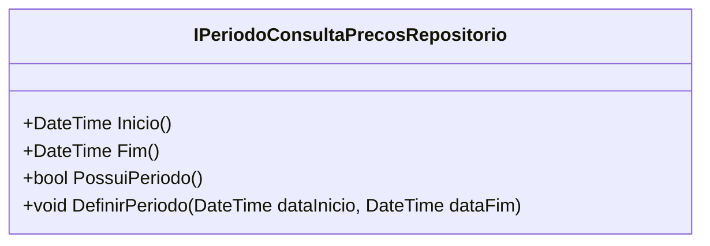

# IPeriodoConsultaPrecosRepositorio
**Namespace**: IsthmusWinthor.Dominio.Interfaces  
**Nome do Arquivo**: IPeriodoConsultaPrecosRepositorio.cs  

### Visão Geral e Responsabilidade
A interface `IPeriodoConsultaPrecosRepositorio` define as operações necessárias para gerenciar períodos de consulta de preços em um sistema de domínio. Sua responsabilidade principal é garantir que o sistema possa controlar e manipular intervalos de tempo com segurança, o que é crucial para a administração de preços ao longo do tempo. Isso é fundamental em cenários onde preços podem variar com base em datas específicas.

### Métodos de Negócio

#### Título: `Inicio` e Visibilidade: `public`
- **Objetivo**: Retornar a data de início do período de consulta de preços.
- **Comportamento**: Este método deve retornar a data que marca o início do intervalo. A implementação deve garantir que esta data esteja definida e válida dentro dos limites do sistema.
- **Retorno**: Um objeto `DateTime` que representa a data de início do período.

#### Título: `Fim` e Visibilidade: `public`
- **Objetivo**: Retornar a data final do período de consulta de preços.
- **Comportamento**: Este método deve retornar a data que marca o fim do intervalo. A implementação deve assegurar que esta data esteja definida e válida, respeitando as regras de negócio que podem limitar o intervalo de preços.
- **Retorno**: Um objeto `DateTime` que representa a data de término do período.

#### Título: `PossuiPeriodo` e Visibilidade: `public`
- **Objetivo**: Verificar se um período de consulta de preços está definido.
- **Comportamento**: Este método deve verificar a existência de um período configurado, retornando verdadeiro ou falso, dependendo se o períod está ativo.
- **Retorno**: Um valor booleano indicando se existem datas de início e fim definidas.

#### Título: `DefinirPeriodo` e Visibilidade: `public`
- **Objetivo**: Definir um novo período de consulta de preços com uma data de início e uma data de fim.
- **Comportamento**: Este método aceita duas datas e deve validar se estas formam um intervalo correto (a data de início deve ser anterior à data de fim). Se as datas não forem válidas, a operação deve falhar e gerar uma exceção ou retorno apropriado.
- **Retorno**: Não retorna valor (void); no entanto, a implementação deve garantir a integridade do intervalo.

### Propriedades Calculadas e de Validação
N/A - A interface não possui propriedades calculadas com lógica ou validações diretamente.

### Navigations Property
N/A - A interface não possui propriedades que referenciam classes complexas do domínio.

### Tipos Auxiliares e Dependências
N/A - A interface não utiliza tipos auxiliares, enumeradores ou classes estáticas que precisem ser linkados.

### Diagrama de Relacionamentos

Esta documentação técnica destina-se a desenvolvedores e arquitetos que precisam entender as regras de negócio associadas ao gerenciamento de períodos de consulta de preços dentro do sistema, facilitando assim o entendimento e a implementação da lógica necessária para o domínio.
