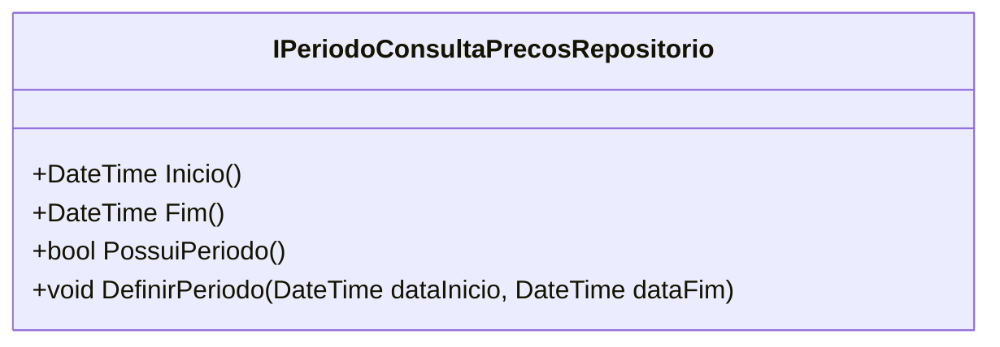

# IPeriodoConsultaPrecosRepositorio
**Namespace**: IsthmusWinthor.Dominio.Interfaces  
**Nome do Arquivo**: IPeriodoConsultaPrecosRepositorio.cs

Este é um repositório que define a interface para o gerenciamento de períodos de consulta de preços no sistema, sendo responsável por fornecer métodos que permitem a manipulação e verificação desses períodos.

## Métodos de Negócio

### 1. `Inicio() : DateTime`
   - **Objetivo**: Retorna a data de início do período de consulta de preços definido.
   - **Comportamento**:
     1. O método é chamado para obter a data de início do período atual.
     2. O valor retornado representa o início do intervalo de datas para consultas de preços.
   - **Retorno**: Retorna um objeto `DateTime` que indica a data de início.

### 2. `Fim() : DateTime`
   - **Objetivo**: Retorna a data de fim do período de consulta de preços definido.
   - **Comportamento**:
     1. O método é utilizado para obter a data de fim do período atual.
     2. O valor retornado representa o final do intervalo de datas para consultas de preços.
   - **Retorno**: Retorna um objeto `DateTime` que indica a data de fim.

### 3. `PossuiPeriodo() : bool`
   - **Objetivo**: Verifica se existe um período de consulta de preços definido.
   - **Comportamento**:
     1. O método é chamado para checar a existência de um período validado.
     2. Retorna verdadeiro se um período válido de consulta de preços estiver definido, caso contrário, retorna falso.
   - **Retorno**: Retorna um valor booleano que indica a existência de um período.

### 4. `DefinirPeriodo(DateTime dataInicio, DateTime dataFim)`
   - **Objetivo**: Define o período de consulta de preços com as datas de início e fim fornecidas.
   - **Comportamento**:
     1. O método é chamado com duas datas, `dataInicio` e `dataFim`.
     2. O sistema valida se `dataInicio` é anterior a `dataFim`.
     3. Se a validação for bem-sucedida, o período de consulta é atualizado.
     4. Se a validação falhar, deve lançar uma exceção (não explicitado no código, mas uma prática comum em situações de erro).
   - **Retorno**: Este método não possui retorno.

## Propriedades Calculadas e de Validação
Nenhuma propriedade calculada ou de validação é definida nesta interface.

## Navigations Property
Nenhuma propriedade de navegação existente é aplicável nesta interface.

## Tipos Auxiliares e Dependências
Nenhum tipo auxiliar ou dependência é utilizada nesta interface.

## Diagrama de Relacionamentos

---
Gerada em 29/12/2025 21:16:41
