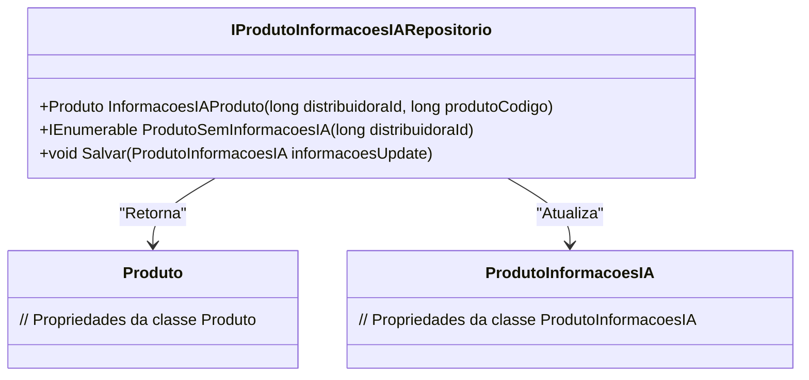

# IProdutoInformacoesIARepositorio
**Namespace**: IsthmusWinthor.Dominio.Interfaces  
**Nome do Arquivo**: IProdutoInformacoesIARepositorio.cs  

## Visão Geral e Responsabilidade
A interface `IProdutoInformacoesIARepositorio` define as operações necessárias para gerenciar informações relacionadas a produtos em um contexto de Inteligência Artificial (IA). Ela desempenha um papel crítico ao permitir que o sistema acesse, atualize e recupere informações associadas a produtos, garantindo que os dados estejam sempre atualizados e disponíveis para tomadas de decisões embasadas por IA.

## Métodos de Negócio

### 1. `InformacoesIAProduto`
- **Objetivo**: Recuperar as informações do produto, dado um ID de distribuidora e um código de produto.
- **Comportamento**: 
  1. O método recebe `distribuidoraId` e `produtoCodigo` como parâmetros.
  2. Ele busca no repositório informações específicas para o produto correspondente às chaves fornecidas.
  3. Retorna uma instância de `Produto` com as informações requisitadas, ou um valor nulo se não encontrar correspondência.
- **Retorno**: Um objeto do tipo `Produto` que contém as informações da inteligência artificial associadas ao produto, ou null caso não haja informações disponíveis.

### 2. `ProdutoSemInformacoesIA`
- **Objetivo**: Listar produtos que não possuem informações de IA associadas.
- **Comportamento**:
  1. O método recebe um `distribuidoraId`.
  2. Ele consulta o repositório para todos os produtos da distribuidora que não têm informações de IA.
  3. Retorna uma lista de produtos que se encaixam nesse critério.
- **Retorno**: Um `IEnumerable<Produto>` que representa os produtos sem informações de IA.

### 3. `Salvar`
- **Objetivo**: Persiste ou atualiza as informações de IA de um produto.
- **Comportamento**:
  1. O método recebe um objeto do tipo `ProdutoInformacoesIA` que contém os dados a serem atualizados.
  2. Ele verifica se as informações já existem no repositório e realiza a atualização se necessário, ou cria um novo registro se não.
  3. As alterações são salvas no contexto do repositório.
- **Retorno**: O método não possui um retorno explícito, mas realiza a ação de persistência.

## Navigations Property
- `Produto` - Representa a classe que contém as informações sobre os produtos.  
  [Produto](Produto.md)  
- `ProdutoInformacoesIA` - Representa a classe que contém as informações especificadas para IA.  
  [ProdutoInformacoesIA](ProdutoInformacoesIA.md)  

## Tipos Auxiliares e Dependências
- `Produto` - Representa a entidade de produto.
- `ProdutoInformacoesIA` - Representa a estrutura das informações de IA a serem armazenadas.

## Diagrama de Relacionamentos

