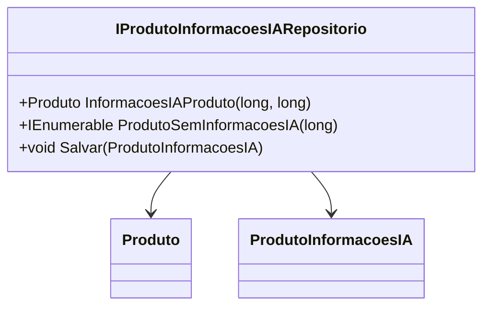

# IProdutoInformacoesIARepositorio
**Namespace**: IsthmusWinthor.Dominio.Interfaces  
**Nome do Arquivo**: IProdutoInformacoesIARepositorio.cs  

## Visão Geral e Responsabilidade
A interface `IProdutoInformacoesIARepositorio` é responsável por definir as operações necessárias para gerenciar as informações dos produtos dentro do domínio da aplicação. Ela provê métodos essenciais para acessar e atualizar informações relacionadas a produtos, numa perspectiva que suporta características como a recuperação de produtos que não possuem informações relacionadas a Inteligência Artificial (IA) e a atualização das informações quando necessário. A interface é fundamental para a implementação de repositórios que interagem diretamente com o armazenamento de dados de produtos, garantindo consistência e integridade nas operações de dados no domínio.

## Métodos de Negócio

### InformacoesIAProduto (Público)
- **Objetivo**: Garante a recuperação das informações de um produto específico com base na distribuidora e no código do produto, assegurando que sejam obtidos dados completos e relevantes.
- **Comportamento**: 
  1. Recebe como parâmetros o `distribuidoraId` e o `produtoCodigo`.
  2. Realiza a busca dessas informações no repositório de dados.
  3. Retorna o objeto `Produto` contendo informações detalhadas.
- **Retorno**: Retorna um objeto `Produto` que contém todas as informações pertinentes à inteligência artificial para o produto especificado.

### ProdutoSemInformacoesIA (Público)
- **Objetivo**: Garante a recuperação de todos os produtos de uma distribuidora que não possuem informações relacionadas a IA, permitindo identificar produtos que podem necessitar de atenção ou melhorias.
- **Comportamento**:
  1. Recebe o `distribuidoraId` como parâmetro.
  2. Realiza a busca de todos os produtos que não possuem informações de IA associadas dentro do repositório.
  3. Retorna uma coleção de produtos que atendem a esse critério.
- **Retorno**: Retorna um `IEnumerable<Produto>`, que fornece a lista de produtos sem informações de IA.

### Salvar (Público)
- **Objetivo**: Garante a atualização das informações de um produto relacionado à IA, assim assegurando que os dados no sistema estejam sempre atualizados e corretos.
- **Comportamento**:
  1. Recebe um objeto `ProdutoInformacoesIA` que contém as novas informações a serem salvas.
  2. Altera ou adiciona as informações no repositório de dados baseando-se na lógica interna de persistência.
  3. Confirma a operação concluída.
- **Retorno**: Não retorna valor, mas implica que a operação foi realizada com sucesso, se não ocorrer uma exceção.

## Propriedades Calculadas e de Validação
A interface não contém propriedades que implementem lógica de cálculo ou validação em seus getters/setters.

## Navigation Property
A interface não contém propriedades de navegação complexas.

## Tipos Auxiliares e Dependências
- **Classes Auxiliares**:
  - [`Produto`](Produto.md)
  - [`ProdutoInformacoesIA`](ProdutoInformacoesIA.md)

## Diagrama de Relacionamentos

---
Gerada em 29/12/2025 21:16:58
