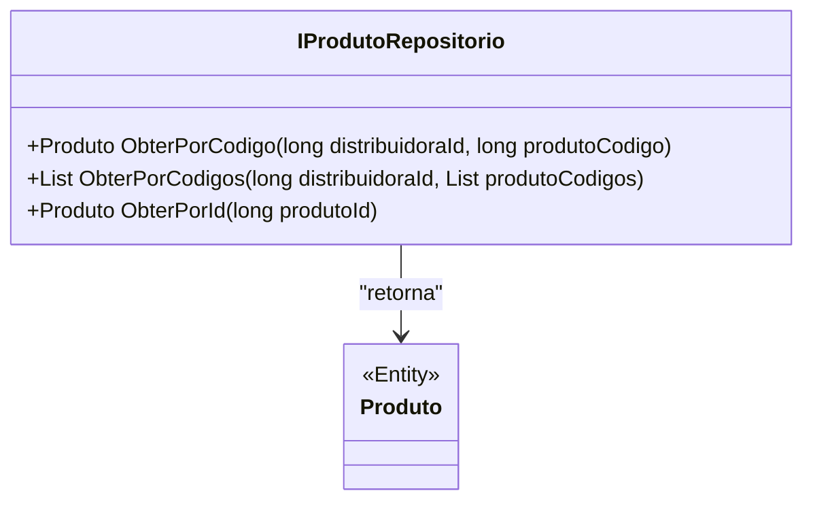

# IProdutoRepositorio
- **Namespace**: IsthmusWinthor.Dominio.Interfaces
- **Nome do Arquivo**: IProdutoRepositorio.cs

Este é um repositório que define as operações necessárias para acessar os dados dos produtos no sistema, facilitando o transporte de dados entre a camada de domínio e a camada de persistência.

## Métodos de Negócio

### 1. `Produto ObterPorCodigo(long distribuidoraId, long produtoCodigo)`
- **Objetivo**: Recuperar um produto específico a partir do código do produto e o código da distribuidora. Este método garante que seja retornado um objeto `Produto` correspondente aos parâmetros informados.
- **Comportamento**: 
  1. Recebe como parâmetros o ID da distribuidora e o código do produto.
  2. Realiza uma consulta ao repositório de dados para buscar o produto que corresponda a ambos os identificadores.
  3. Se um produto correspondente for encontrado, ele é retornado. Caso contrário, pode retornar um valor nulo ou gerar uma exceção, dependendo da implementação.
- **Retorno**: Um objeto `Produto` que corresponde ao código informado, ou `null` se não encontrado.

### 2. `List<Produto> ObterPorCodigos(long distribuidoraId, List<long> produtoCodigos)`
- **Objetivo**: Retornar uma lista de produtos com base em uma coleção de códigos, permitindo a recuperação de múltiplos produtos de uma só vez.
- **Comportamento**:
  1. Recebe o ID da distribuidora e uma lista de códigos de produtos.
  2. Realiza uma consulta ao repositório para buscar todos os produtos que correspondam aos códigos fornecidos.
  3. Retorna uma lista com todos os produtos encontrados.
- **Retorno**: Uma lista de objetos `Produto` que correspondem aos códigos fornecidos. A lista pode estar vazia se nenhum produto for encontrado.

### 3. `Produto ObterPorId(long produtoId)`
- **Objetivo**: Recuperar um produto a partir do seu ID único, garantindo que informações de um produto específico possam ser acessadas.
- **Comportamento**:
  1. Recebe o ID do produto como parâmetro.
  2. Realiza uma consulta ao repositório para buscar o produto que corresponda ao ID informado.
  3. Retorna o objeto `Produto` correspondente ou pode retornar um valor nulo se não encontrado.
- **Retorno**: Um objeto `Produto` que corresponde ao ID informado, ou `null` se não encontrado.

## Propriedades Calculadas e de Validação
Não há propriedades calculadas ou de validação a serem especificadas nesta interface, pois o foco são os métodos do repositório.

## Navigations Property
Não há propriedades que sejam classes complexas do domínio, uma vez que a interface apenas expõe métodos para a manipulação de dados.

## Tipos Auxiliares e Dependências
Não utiliza Enumeradores ou Classes Estáticas/Helpers na implementação da interface.

## Diagrama de Relacionamentos

Este diagrama ilustra a relação entre a interface `IProdutoRepositorio` e a classe `Produto`, destacando que os métodos da interface retornam objetos do tipo `Produto`.
