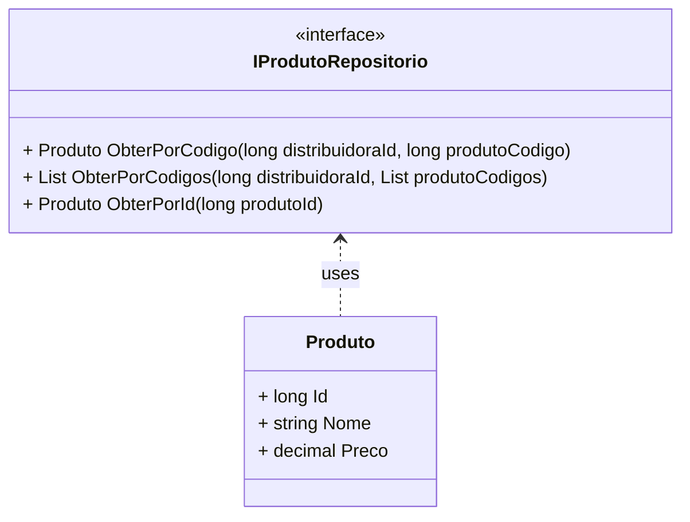

# IProdutoRepositorio
**Namespace**: IsthmusWinthor.Dominio.Interfaces  
**Nome do Arquivo**: IProdutoRepositorio.cs  

Esta interface serve para definir operações de acesso aos dados dos produtos, sendo utilizada como um contrato para a implementação de repositórios que interagem com a camada de persistência de dados.

## Métodos de Negócio

### 1. ObterPorCodigo
- **Título**: ObterPorCodigo - Visibilidade: público
- **Objetivo**: Permitir a obtenção de um produto específico utilizando o identificador da distribuidora e o código do produto. Garantindo a integridade dos dados ao buscar registros específicos.
- **Comportamento**:
  1. Recebe como parâmetros `distribuidoraId` e `produtoCodigo`.
  2. Realiza uma consulta ao banco de dados, buscando um produto que corresponda ao par de identificadores fornecido.
  3. Retorna o objeto `Produto` correspondente ao código fornecido.
- **Retorno**: Retorna um objeto `Produto` se encontrado, ou `null` caso não exista um produto correspondente.

### 2. ObterPorCodigos
- **Título**: ObterPorCodigos - Visibilidade: público
- **Objetivo**: Recuperar uma lista de produtos com base em múltiplos códigos, mantendo a integridade dos dados ao buscar informações correlacionadas.
- **Comportamento**:
  1. Recebe como parâmetros `distribuidoraId` e uma lista de `produtoCodigos`.
  2. Realiza uma consulta ao banco de dados que interceta vários produtos com os códigos fornecidos que pertencem à mesma distribuidora.
  3. Retorna uma lista de objetos `Produto` que correspondem aos códigos informados.
- **Retorno**: Retorna uma lista de objetos `Produto`. Caso nenhum produto seja encontrado, a lista será vazia.

### 3. ObterPorId
- **Título**: ObterPorId - Visibilidade: público
- **Objetivo**: Recuperar um produto específico a partir do seu identificador único, garantindo o acesso direto e seguro às informações do produto.
- **Comportamento**:
  1. Recebe como parâmetro `produtoId`.
  2. Realiza uma consulta ao banco de dados para buscar o produto que corresponde ao identificador fornecido.
  3. Retorna o objeto `Produto` correspondente ao ID informado.
- **Retorno**: Retorna um objeto `Produto` se encontrado, ou `null` caso não exista um produto correspondente.

## Tipos Auxiliares e Dependências
- Esta interface não define enumeradores ou classes auxiliares, mas depende da classe [Produto](Produto.md) para sua implementação.

## Diagrama de Relacionamentos

---
Gerada em 29/12/2025 21:17:16
