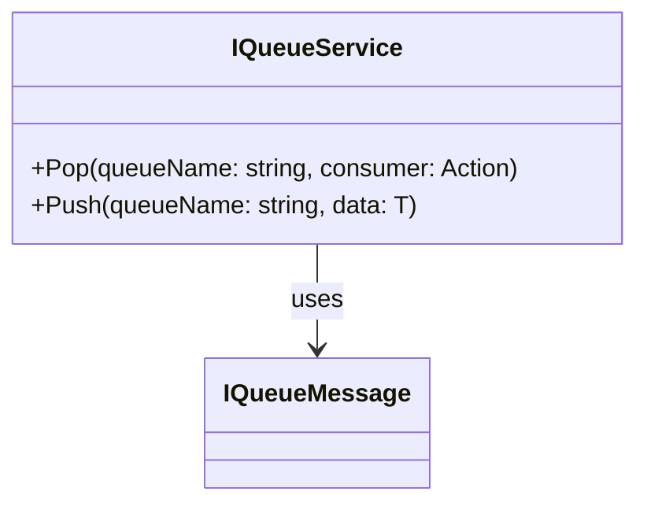

# IQueueService
**Namespace**: IsthmusWinthor.Dominio.Interfaces  
**Nome do Arquivo**: IQueueService.cs

A interface `IQueueService` estabelece um contrato para serviços de manipulação de filas, facilitando a troca de mensagens entre diferentes componentes do sistema. Sua implementação garante que mensagens possam ser empilhadas (push) e removidas (pop) de maneira confiável, assegurando que as regras de negócio associadas à comunicação assíncrona entre módulos sejam respeitadas.

### Métodos de Negócio

#### Método: `Pop<T>(string queueName, Action<T> consumer)`
- **Visibilidade**: Public
- **Objetivo**: Garante a extração de mensagens de uma fila, permitindo que um consumidor processe a mensagem recebida.
- **Comportamento**: 
  1. Recebe o nome da fila e um consumidor como parâmetros.
  2. A fila identificada é buscada.
  3. A mensagem é removida da fila.
  4. O consumidor é chamado com a mensagem removida.
  5. Ao final, a mensagem é processada pelo consumidor, que pode realizar ações adicionais conforme a lógica da aplicação.
- **Retorno**: O método não retorna um valor; o resultado é processado através do consumidor.

#### Método: `Push<T>(string queueName, T data)`
- **Visibilidade**: Public
- **Objetivo**: Garante o armazenamento de mensagens na fila especificada.
- **Comportamento**: 
  1. Recebe o nome da fila e os dados a serem enviados como parâmetros.
  2. A fila identificada é buscada ou criada se não existir.
  3. Os dados são empilhados na fila para posterior processamento.
  4. A operação é completada, garantindo que a mensagem esteja disponível na fila.
- **Retorno**: O método não retorna um valor, confirmando apenas a inclusão dos dados na fila.

### Tipos Auxiliares e Dependências
- Interface: [IQueueMessage](IQueueMessage.md)

### Diagrama de Relacionamentos

---
Gerada em 29/12/2025 21:17:27
