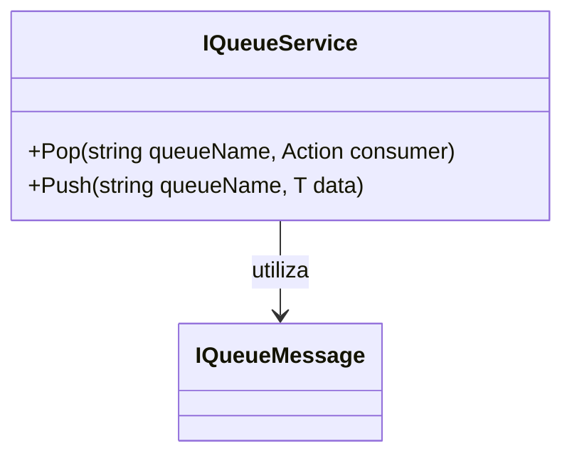

# IQueueService

**Namespace**: IsthmusWinthor.Dominio.Interfaces  
**Nome do Arquivo**: IQueueService.cs

## Visão Geral e Responsabilidade
A interface `IQueueService` atua como um contrato para serviços de fila no sistema. Ela permite que o sistema envie (`Push`) e receba (`Pop`) mensagens através de filas, facilitando a comunicação assíncrona entre diferentes componentes da aplicação. Essa abstração é essencial em sistemas distribuídos ou em arquiteturas baseadas em microsserviços, onde a troca de mensagens entre serviços é um padrão comum. Ela resolve problemas relacionados à decoupling de componentes, permitindo uma melhor escalabilidade e resiliência do sistema.

## Métodos de Negócio

### `Pop<T>(string queueName, Action<T> consumer)` - Público
- **Objetivo**: Garante a retirada de uma mensagem da fila para processamento.
- **Comportamento**: 
  1. O método recebe o nome da fila como um parâmetro.
  2. Em seguida, ele utiliza uma ação do consumidor, que processará a mensagem retirada da fila.
  3. A operação é tipada, garantindo que a mensagem retirada seja compatível com o tipo `T` que implementa a interface `IQueueMessage`.
- **Retorno**: Este método não retorna um valor; o resultado do processamento da mensagem é gerenciado pelo consumidor fornecido.

### `Push<T>(string queueName, T data)` - Público
- **Objetivo**: Garante a inserção de uma mensagem na fila.
- **Comportamento**: 
  1. O método recebe o nome da fila e os dados a serem enviados como parâmetros.
  2. Os dados devem ser do tipo `T`, que deve implementar a interface `IQueueMessage`, assegurando assim que apenas mensagens válidas sejam adicionadas à fila.
  3. A operação adiciona a mensagem na fila especificada para ser consumida posteriormente.
- **Retorno**: Este método não retorna um valor, mas assegura que a mensagem foi registrada na fila.

## Propriedades Calculadas e de Validação
Não existem propriedades com lógica de cálculo no `get` ou validação no `set` nesta interface, pois seu propósito é ser um contrato para interação com filas.

## Navigation Property
Não existem propriedades complexas do domínio que estejam associadas a esta interface.

## Tipos Auxiliares e Dependências
- `IQueueMessage`: Interface que deve ser implementada pelas mensagens que serão processadas pela fila.

## Diagrama de Relacionamentos

