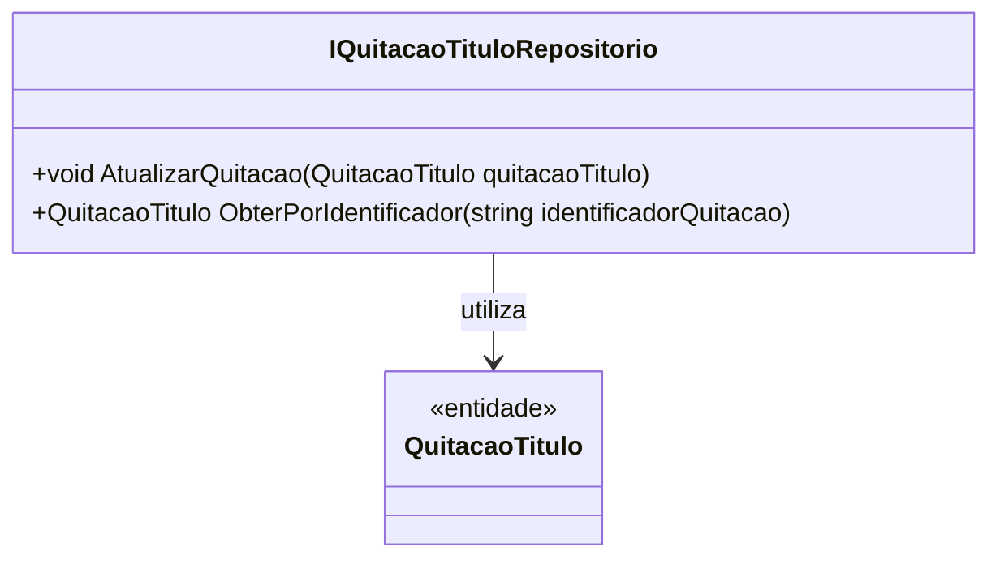

# IQuitacaoTituloRepositorio
**Namespace**: IsthmusWinthor.Dominio.Interfaces  
**Nome do Arquivo**: IQuitacaoTituloRepositorio.cs  

### Visão Geral e Responsabilidade
A interface `IQuitacaoTituloRepositorio` define as operações fundamentais para a persistência e recuperação de informações relacionadas à quitação de títulos. Ela é essencial para a gestão de títulos financeiros dentro do sistema, garantindo que as operações de quitação sejam realizadas de maneira consistente e confiável. Através dessa interface, o sistema pode atualizar o status de quitação dos títulos e recuperar informações detalhadas sobre uma quitação específica, o que ajuda a manter a integridade dos dados financeiros.

### Métodos de Negócio

#### Título: `AtualizarQuitacao` (Visibilidade: `public`)
- **Objetivo:** Garante que a quitação de um título específico seja atualizada corretamente na base de dados.
- **Comportamento:**
  1. Recebe um objeto `QuitacaoTitulo` como parâmetro.
  2. Valida o estado do objeto para assegurar que ele contém informações corretas.
  3. Atualiza a entrada correspondente na base de dados com os novos dados de quitação do título.
  4. Lança uma exceção se a atualização falhar, mantendo a integridade do sistema.
- **Retorno:** Não possui retorno; a operação é realizada como uma ação.

#### Título: `ObterPorIdentificador` (Visibilidade: `public`)
- **Objetivo:** Permite a recuperação de uma quitação com base em seu identificador único, possibilitando a consulta de informações detalhadas.
- **Comportamento:**
  1. Recebe um `identificadorQuitacao` como parâmetro.
  2. Consulta a base de dados utilizando o identificador fornecido.
  3. Retorna o objeto `QuitacaoTitulo` correspondente ou lança uma exceção se não for encontrado.
- **Retorno:** Retorna um objeto `QuitacaoTitulo` que contém as informações da quitação buscada. 

### Propriedades Calculadas e de Validação
N/A - A interface não contém propriedades que implementem lógica de cálculo ou validação.

### Navigations Property
N/A - A interface não possui propriedades que referenciem classes complexas do domínio.

### Tipos Auxiliares e Dependências
N/A - A interface não utiliza enumeradores ou classes estáticas/helpers diretamente.

### Diagrama de Relacionamentos

---
Gerada em 29/12/2025 21:17:42
