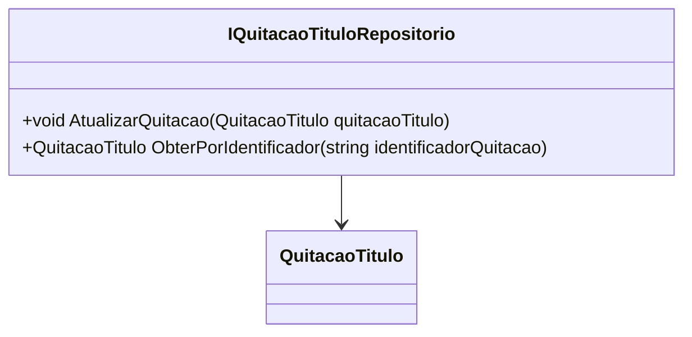

# IQuitacaoTituloRepositorio
**Namespace**: IsthmusWinthor.Dominio.Interfaces  
**Nome do Arquivo**: IQuitacaoTituloRepositorio.cs  

Este arquivo define uma interface para a manipulação de objetos do tipo `QuitacaoTitulo`, sendo responsável pela atualização e recuperação de informações relacionadas a quitações de títulos no sistema.

## Métodos de Negócio

### AtualizarQuitacao
- **Título**: `void AtualizarQuitacao(QuitacaoTitulo quitacaoTitulo)`
- **Objetivo**: Garante que a quitação de um título seja atualizada no repositório, persistindo as alterações necessárias no estado do objeto `QuitacaoTitulo`.
- **Comportamento**: 
  1. Recebe um objeto `QuitacaoTitulo` que possui os dados atualizados.
  2. O repositório tenta encontrar a entrada correspondente no armazenamento.
  3. Se a entrada existir, os dados são sobrescritos com as informações do objeto recebido.
  4. Caso contrário, pode lançar uma exceção ou registrar uma falha na atualização.
  
- **Retorno**: Não há retorno, mas implicações de erro podem ocorrer se a atualização falhar.

### ObterPorIdentificador
- **Título**: `QuitacaoTitulo ObterPorIdentificador(string identificadorQuitacao)`
- **Objetivo**: Permite a recuperação de um objeto `QuitacaoTitulo` com base em um identificador único, garantindo o acesso rápido e eficiente a informações relevantes sobre a quitação.
- **Comportamento**: 
  1. Recebe um identificador único como entrada.
  2. Busca no repositório por um `QuitacaoTitulo` que corresponda ao identificador.
  3. Se encontrado, retorna o objeto `QuitacaoTitulo` correspondente.
  4. Se não encontrado, pode retornar `null` ou lançar uma exceção, conforme a implementação.
  
- **Retorno**: Retorna um objeto `QuitacaoTitulo` se encontrado, ou um valor padrão (como `null`) se não encontrado.

## Navegações de Propriedade
Atualmente, a interface `IQuitacaoTituloRepositorio` não possui propriedades que referenciam classes complexas do domínio, já que se trata de uma interface e não de uma classe concreta.

## Tipos Auxiliares e Dependências
- Não há Enumeradores ou Classes Estáticas/Helpers diretamente mencionadas nesta interface.

## Diagrama de Relacionamentos

Esta documentação técnica fornece uma visão clara das responsabilidades e regras de negócio associadas à interface `IQuitacaoTituloRepositorio`, enfatizando a importância das operações de persistência e recuperação de dados dentro do domínio.
