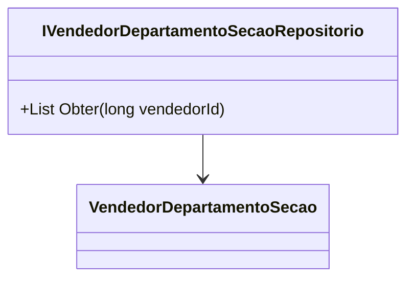

# IVendedorDepartamentoSecaoRepositorio
**Namespace**: IsthmusWinthor.Dominio.Interfaces  
**Nome do Arquivo**: IVendedorDepartamentoSecaoRepositorio.cs  

## Visão Geral e Responsabilidade
A interface `IVendedorDepartamentoSecaoRepositorio` é responsável por definir a operação de recuperação das informações de seção e departamento associadas a um vendedor específico. Essa interface serve como um contrato que orienta a implementação de repositórios concretos que acessam dados relacionados a vendedores, permitindo uma separação clara das regras de acesso a dados da lógica de negócio.

## Métodos de Negócio

### Título: Obter (public)
- **Objetivo**: Este método garante que é possível obter todas as seções e departamentos associados a um vendedor, dado seu identificador único. Isso é crucial para a construção de funcionalidades que dependem da compreensão do contexto de um vendedor dentro da organização.
- **Comportamento**:
  1. Recebe um `vendedorId` como parâmetro.
  2. Acessa a base de dados ou outra fonte de dados para buscar todas as instâncias de `VendedorDepartamentoSecao` que estão relacionadas ao `vendedorId` fornecido.
  3. Retorna uma lista de `VendedorDepartamentoSecao` que contém todas as seções e departamentos vinculados ao vendedor.
- **Retorno**: O método retorna uma lista de objetos do tipo `VendedorDepartamentoSecao`, que representa o estado das associações do vendedor às seções e departamentos.

## Propriedades Calculadas e de Validação
Não existem propriedades calculadas ou de validação nesta interface, uma vez que a mesma consiste apenas em definição de método sem lógica de cálculo intrínseca.

## Navigations Property
Não há propriedades complexas do domínio, uma vez que a interface define unicamente um método de operação sem incluir implementações específicas.

## Tipos Auxiliares e Dependências
- Classe utilizada: [VendedorDepartamentoSecao](VendedorDepartamentoSecao.md)

## Diagrama de Relacionamentos

Esta documentação abrange as regras de negócio associadas à interface `IVendedorDepartamentoSecaoRepositorio`, destacando a importância da separação de responsabilidades e a utilização de contratos para o acesso a dados.
---
Gerada em 29/12/2025 21:17:54
