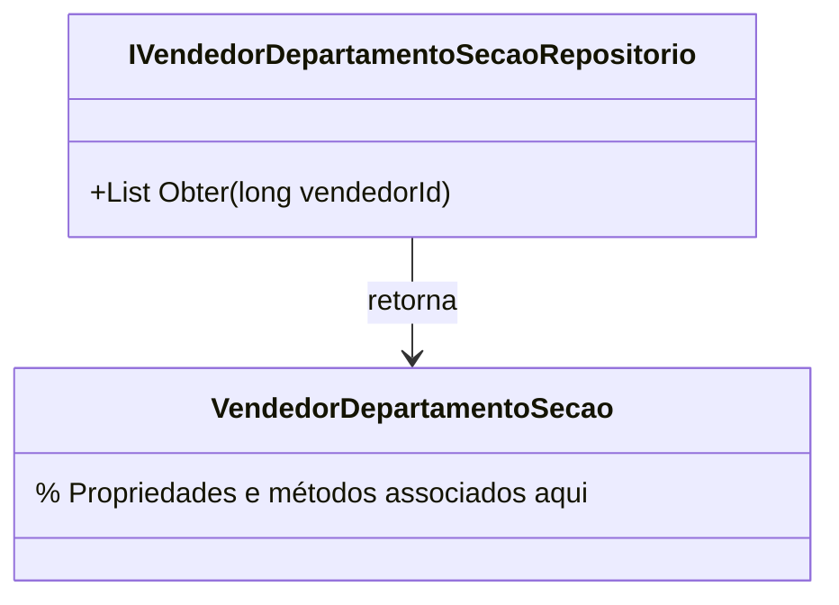

# IVendedorDepartamentoSecaoRepositorio

**Namespace**: IsthmusWinthor.Dominio.Interfaces  
**Nome do Arquivo**: IVendedorDepartamentoSecaoRepositorio.cs  

## Visão Geral e Responsabilidade
A interface `IVendedorDepartamentoSecaoRepositorio` é responsável por definir a abstração necessária para a recuperação das seções de departamento atribuídas a um vendedor específico. Essa interface é crucial para garantir que o sistema possa acessar de forma eficiente as informações de vínculo entre vendedores e suas respectivas seções, promovendo a integridade e a organização dos dados ao permitir que ações comerciais sejam sempre direcionadas à seção correta.

## Métodos de Negócio

### Título: `Obter` (Visibilidade: público)
- **Objetivo**: Garante a recuperação das seções associadas a um vendedor pelo seu identificador único.
- **Comportamento**: 
  1. Recebe um parâmetro `vendedorId`, que representa a identificação do vendedor no sistema.
  2. Executa uma operação de recuperação no repositório.
  3. Retorna uma lista de objetos `VendedorDepartamentoSecao` que correspondem ao vendedor informado.
- **Retorno**: Retorna uma lista de `VendedorDepartamentoSecao`. Se não houver seções associadas ao vendedor, a lista retornada será vazia, indicando que o vendedor não possui nenhuma seção atribuída.

## Tipos Auxiliares e Dependências
- `VendedorDepartamentoSecao`: classe utilizada como retorno no método `Obter`.

## Diagrama de Relacionamentos

