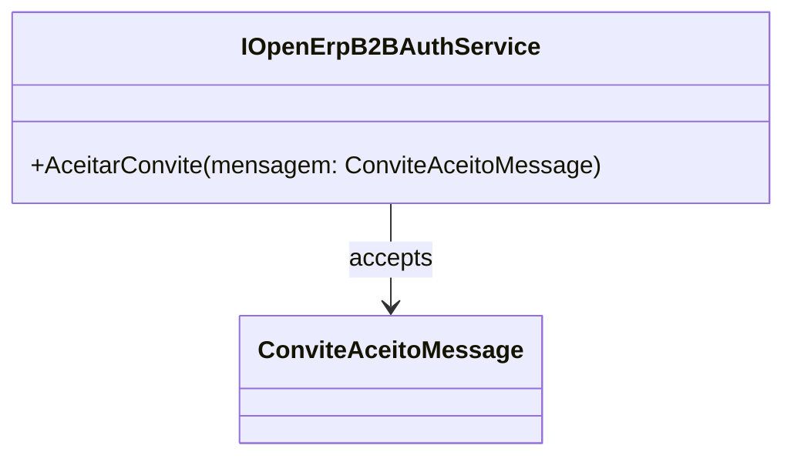

# IOpenErpB2BAuthService
**Namespace**: IsthmusWinthor.Dominio.Interfaces.OpenErpConectores  
**Nome do Arquivo**: IOpenErpB2BAuthService.cs  

## Visão Geral e Responsabilidade
A interface `IOpenErpB2BAuthService` define um contrato para a autenticação no sistema B2B do Open ERP, relacionado ao processo de aceitação de convites de parcerias comerciais. Esta classe serve como um ponto de integração que facilita a comunicação e a validação dos convites recebidos, garantindo que apenas convites válidos sejam aceitos, promovendo assim a integridade no processo de parcerias.

## Métodos de Negócio

### Título: AceitarConvite (Visibilidade: public)
- **Objetivo**: Este método garante que um convite enviado para a parceria seja aceito formalmente no sistema. Ele assegura que o fluxo de aceitação de convites siga as regras de negócio definidas, mantendo a integridade do relacionamento entre as partes envolvidas.
- **Comportamento**:
  1. Recebe uma instância de `ConviteAceitoMessage`, que contém as informações necessárias sobre o convite a ser aceito.
  2. Processa a mensagem e executa a lógica interna para validar o convite (a validação em si não é mostrada nesta interface; seria implementada na classe concreta).
  3. Se a validação for bem-sucedida, o convite é aceito e as ações subsequentes são realizadas (novamente, o que acontece depois depende da implementação).
- **Retorno**: Este método não retorna um valor; a aceitação do convite resulta em um efeito colateral que seria tratado no nível da implementação, possivelmente afetando estados ou enviando notificações.

## Propriedades Calculadas e de Validação
Não há propriedades calculadas ou de validação na interface, pois ela consiste apenas em métodos que não contêm lógica de estado.

## Navigations Property
Não há propriedades de navegação na interface, uma vez que se trata de um contrato funcional sem estado explícito.

## Tipos Auxiliares e Dependências
- **Dependências**: 
  - `ConviteAceitoMessage`: Representa a mensagem que está sendo aceita.
  
## Diagrama de Relacionamentos

Esta documentação técnica resume a responsabilidade e as interações do serviço de autenticação B2B, contribuindo para a clareza e eficiência do desenvolvimento de sistemas que utilizam essa interface.
---
Gerada em 29/12/2025 21:18:09
