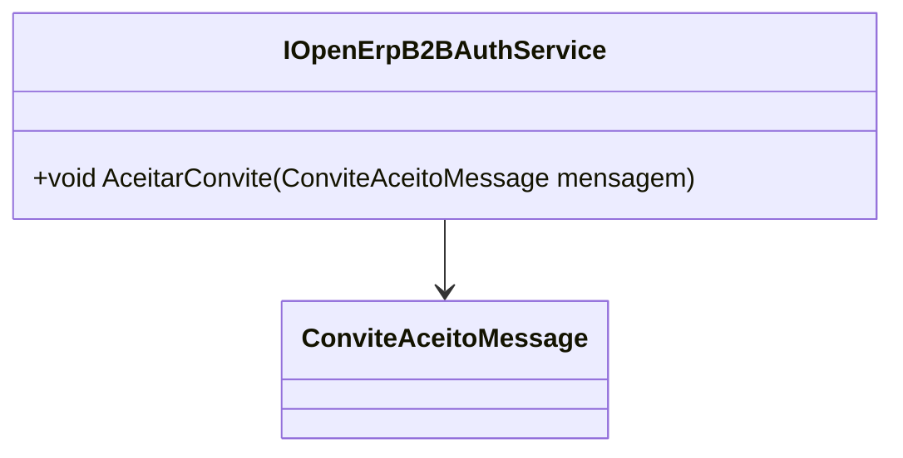

# IOpenErpB2BAuthService
**Namespace**: IsthmusWinthor.Dominio.Interfaces.OpenErpConectores  
**Nome do Arquivo**: IOpenErpB2BAuthService.cs  

---

## Visão Geral e Responsabilidade
A interface `IOpenErpB2BAuthService` define um contrato para serviços de autenticação no contexto do sistema OpenErp para B2B (Business to Business). O papel principal da interface é assegurar o correto processamento de convites aceitos por empresas que desejam se integrar ao sistema, o que resolve a necessidade de controle e validação de acesso dentro do ecossistema OpenErp. A implementação desta interface deve garantir que as mensagens de convite sejam tratadas de acordo com as regras de negócio estabelecidas, promovendo assim uma integração segura e eficiente.

## Métodos de Negócio

### Título: AceitarConvite (void)
- **Objetivo**: Garante que um convite enviado por uma empresa parceira seja aceito e processado adequadamente.
- **Comportamento**: 
    1. Recebe uma mensagem do tipo `ConviteAceitoMessage` que contém informações sobre o convite que está sendo aceito.
    2. Esta mensagem deve ser validada para confirmar que o convite é legítimo e que a empresa está autorizada a aceitá-lo.
    3. Após a validação, o serviço deve processar o convite, o que pode incluir atualizar estados de relacionamento no sistema, notificar usuários relevantes e registrar a aceitação para fins de auditoria.
- **Retorno**: Este método não retorna nenhum valor, mas pode gerar eventos ou atualizações de estado em outras partes do sistema como resultado da sua execução.

## Propriedades Calculadas e de Validação
- N/A (A interface não possui propriedades que realizam cálculos ou validações).

## Navigations Property
- N/A (A interface não contém propriedades de navegação para classes complexas do domínio).

## Tipos Auxiliares e Dependências
- [`ConviteAceitoMessage`](ConviteAceitoMessage.md) - Representa a mensagem que contém os dados do convite que está sendo aceito.

## Diagrama de Relacionamentos

