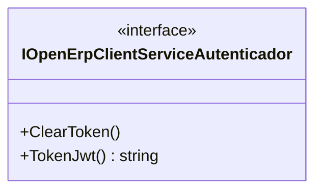

# IOpenErpClientServiceAutenticador
**Namespace**: IsthmusWinthor.Dominio.Interfaces.OpenErpConectores  
**Nome do Arquivo**: IOpenErpClientServiceAutenticador.cs

Esta interface é responsável por definir um contrato para autenticação de clientes no sistema OpenErp, garantindo a manipulação segura e eficiente de tokens JWT.

## Métodos de Negócio

### `void ClearToken()`
- **Objetivo**: Garante que o token de autenticação atual seja removido, prevenindo o uso acidental de tokens obsoletos ou inválidos.
- **Comportamento**: Este método deve ser chamado quando o cliente precisa se desconectar ou quando a sessão expira, garantindo que não haja mais um token em memória que possa ser reutilizado indevidamente.
- **Retorno**: Este método não possui retorno, mas sua execução implica que o estado de autenticação do cliente foi redefinido.

### `string TokenJwt()`
- **Objetivo**: Recupera o token JWT atual utilizado para autenticação no sistema OpenErp.
- **Comportamento**: O método deve verificar se um token válido está presente e retorná-lo. Caso não exista um token válido, pode lançar uma exceção ou retornar um valor nulo, dependendo da implementação, sugerindo que uma nova autenticação seja necessária.
- **Retorno**: Retorna uma string que representa o token JWT válido ou nulo, indicando se a autenticação foi bem-sucedida ou não.

## Tipos Auxiliares e Dependências
Não existem tipos auxiliares (Enums ou Classes) diretamente associados a esta interface.

## Diagrama de Relacionamentos

Este diagrama ilustra a interface `IOpenErpClientServiceAutenticador` e os métodos que ela expõe para a classe que implementará o contrato. Em vista de que se trata de uma interface, não existem propriedades complexas ou enums associados.
