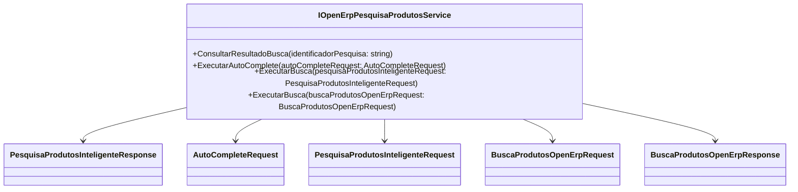

# IOpenErpPesquisaProdutosService
**Namespace**: IsthmusWinthor.Dominio.Interfaces.OpenErpConectores  
**Nome do Arquivo**: IOpenErpPesquisaProdutosService.cs  

## Visão Geral e Responsabilidade
A interface `IOpenErpPesquisaProdutosService` atua como um contraponto às funcionalidades de busca de produtos em um sistema ERP. Ela tem como responsabilidade definir os métodos que permitem consultar e realizar buscas de produtos de maneira inteligente, com base em identificadores e solicitações específicas, facilitando o acesso a informações essenciais para a tomada de decisão no contexto empresarial.

## Métodos de Negócio

### 1. ConsultarResultadoBusca
- **Título**: `ConsultarResultadoBusca` (Público)
- **Objetivo**: Garante a recuperação de resultados de uma pesquisa de produtos utilizando um identificador único.
- **Comportamento**: 
  1. Recebe um `identificadorPesquisa` do tipo `string`.
  2. Processa a solicitação consultando o banco de dados ou um serviço externo.
  3. Retorna um objeto `PesquisaProdutosInteligenteResponse` com os dados relevantes da pesquisa.
- **Retorno**: Um objeto `PesquisaProdutosInteligenteResponse` que contém os resultados da consulta de forma estruturada.

### 2. ExecutarAutoComplete
- **Título**: `ExecutarAutoComplete` (Público)
- **Objetivo**: Facilita o fornecimento de sugestões automáticas baseadas na entrada parcial do usuário.
- **Comportamento**: 
  1. Recebe um objeto `AutoCompleteRequest`.
  2. Utiliza a informação contida no objeto para gerar uma lista de sugestões relevantes.
  3. Retorna uma lista de `string` com as sugestões.
- **Retorno**: Uma lista de strings que representa as opções de auto-completar para a pesquisa.

### 3. ExecutarBusca
- **Título**: `ExecutarBusca` (Público)
- **Objetivo**: Realiza a pesquisa de produtos com base em um conjunto de critérios definidos pelo usuário.
- **Comportamento**: 
  1. Recebe um objeto `PesquisaProdutosInteligenteRequest`.
  2. Processa a lógica de pesquisa aplicando critérios filtrados.
  3. Retorna uma string que representa os resultados ou status da busca.
- **Retorno**: Uma string que contém os resultados da busca ou uma mensagem informativa.

### 4. ExecutarBusca
- **Título**: `ExecutarBusca` (Público)
- **Objetivo**: Executa uma busca de produtos em um sistema ERP específico.
- **Comportamento**: 
  1. Recebe um objeto `BuscaProdutosOpenErpRequest`.
  2. Executa a lógica de busca integrada ao sistema ERP.
  3. Retorna um objeto `BuscaProdutosOpenErpResponse` com os produtos encontrados.
- **Retorno**: Um objeto `BuscaProdutosOpenErpResponse` contendo os detalhes dos produtos encontrados.

## Navigations Property
Não existem propriedades complexas do domínio nesta interface, pois a mesma é composta apenas por métodos.

## Tipos Auxiliares e Dependências
- Classes e DTOs usados:
  - `[PesquisaProdutosInteligenteResponse](PesquisaProdutosInteligenteResponse.md)`
  - `[AutoCompleteRequest](AutoCompleteRequest.md)`
  - `[PesquisaProdutosInteligenteRequest](PesquisaProdutosInteligenteRequest.md)`
  - `[BuscaProdutosOpenErpRequest](BuscaProdutosOpenErpRequest.md)`
  - `[BuscaProdutosOpenErpResponse](BuscaProdutosOpenErpResponse.md)`

## Diagrama de Relacionamentos

