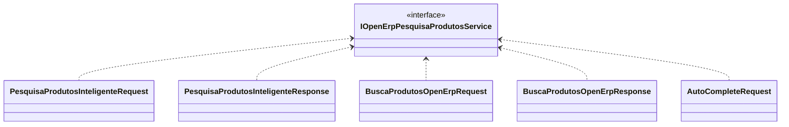

# IOpenErpPesquisaProdutosService
**Namespace**: IsthmusWinthor.Dominio.Interfaces.OpenErpConectores  
**Nome do Arquivo**: IOpenErpPesquisaProdutosService.cs  

## Visão Geral e Responsabilidade
A interface `IOpenErpPesquisaProdutosService` atua como um contrato para serviços que realizam operações relacionadas à pesquisa de produtos em uma integração com o OpenERP. Ela encapsula a lógica necessária para buscar produtos baseados em diferentes critérios e otimiza a experiência do usuário ao fornecer funcionalidades como busca, auto-complete e consulta a resultados específicos. O principal problema de negócio que esta interface resolve é a acessibilidade e rapidez de pesquisa de produtos, facilitando a interação do usuário com o sistema.

## Métodos de Negócio

### ConsultarResultadoBusca (public)
- **Objetivo**: Garante que o sistema possa consultar resultados de busca específicos pelo identificador da pesquisa, permitindo que os usuários acessem informações de pesquisa previamente realizadas.
- **Comportamento**: Este método recebe um `identificadorPesquisa` como parâmetro e busca os resultados associados a este identificador. 
- **Retorno**: Retorna um objeto `PesquisaProdutosInteligenteResponse` que contém os resultados da busca realizada, encapsulando os produtos obtidos.

### ExecutarAutoComplete (public)
- **Objetivo**: Oferece sugestões automáticas durante a digitação da pesquisa, ajudando o usuário a formular suas consultas de maneira mais eficiente.
- **Comportamento**: Este método recebe um objeto `AutoCompleteRequest`, processa as informações contidas nele e gera uma lista de strings que representam as sugestões de autocompletar baseadas no que foi digitado.
- **Retorno**: Retorna uma lista de strings que representam as sugestões para o auto-complete.

### ExecutarBusca (public)
- **Objetivo**: Realiza uma busca completa de produtos com base nas informações fornecidas pelo usuário através de um objeto `PesquisaProdutosInteligenteRequest`.
- **Comportamento**: O método processa a requisição, executa a lógica necessária para buscar os produtos respeitando as regras de negócio definidas e retorna os resultados.
- **Retorno**: Retorna uma string que pode conter informações sobre o resultado da busca ou um código que representa o status da operação.

### ExecutarBusca (public)
- **Objetivo**: Permite a realização de uma busca de produtos utilizando parâmetros específicos encapsulados em `BuscaProdutosOpenErpRequest`.
- **Comportamento**: Este método aceita a requisição como entrada, executa a lógica de busca de acordo com os parâmetros fornecidos e retorna os resultados.
- **Retorno**: Retorna um objeto do tipo `BuscaProdutosOpenErpResponse`, que inclui as informações dos produtos encontrados.

## Tipos Auxiliares e Dependências
- **Pedido de AutoComplete**: `AutoCompleteRequest`
- **Requisição de Pesquisa de Produtos**: `PesquisaProdutosInteligenteRequest`
- **Resposta de Pesquisa de Produtos**: `PesquisaProdutosInteligenteResponse`
- **Requisição de Busca de Produtos OpenErp**: `BuscaProdutosOpenErpRequest`
- **Resposta de Busca de Produtos OpenErp**: `BuscaProdutosOpenErpResponse`

## Diagrama de Relacionamentos

---
Gerada em 29/12/2025 21:18:34
