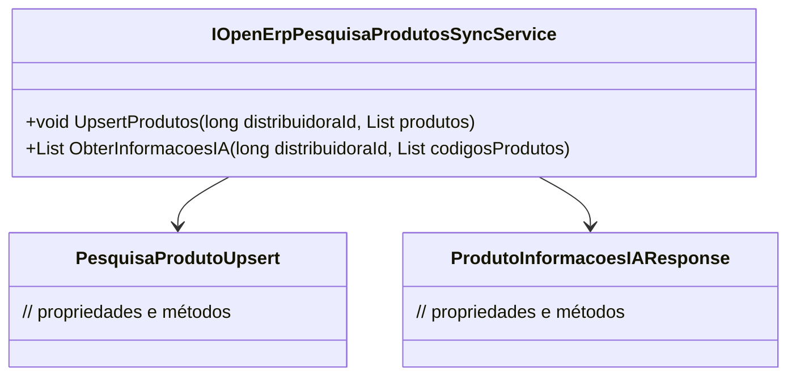

# IOpenErpPesquisaProdutosSyncService
- **Namespace**: IsthmusWinthor.Dominio.Interfaces.OpenErpConectores
- **Nome do Arquivo**: IOpenErpPesquisaProdutosSyncService.cs

## Visão Geral e Responsabilidade
A interface `IOpenErpPesquisaProdutosSyncService` define as operações necessárias para a sincronização de produtos entre o sistema corporativo e um sistema de ERP externo. A classe desempenha um papel crítico na integração de dados, garantindo que as informações dos produtos estejam sempre atualizadas e acessíveis para as partes interessadas. O problema de negócio que resolve é a necessidade de um sistema confiável e eficiente para gerenciar os dados dos produtos, evitando duplicidade e garantindo a integridade das informações.

## Métodos de Negócio

### 1. Método: `UpsertProdutos` (Visibilidade: Public)
- **Objetivo**: Este método garante que os produtos sejam inseridos ou atualizados na base de dados, dependendo se eles já existem ou não.
- **Comportamento**: 
  1. Recebe um `distribuidoraId` e uma lista de produtos.
  2. Verifica se cada produto da lista já existe no banco de dados.
  3. Se o produto não existir, realiza a inserção.
  4. Se o produto já existir, realiza a atualização das informações.
  5. Finaliza a operação garantindo que todos os produtos estejam atualizados na base de dados.
- **Retorno**: Este método não retorna valor, mas realiza ações de persistência de dados, garantindo a integridade das informações na base.

### 2. Método: `ObterInformacoesIA` (Visibilidade: Public)
- **Objetivo**: Este método busca informações de inteligência artificial (IA) para produtos específicos, facilitando a tomada de decisões baseado em dados.
- **Comportamento**: 
  1. Recebe um `distribuidoraId` e uma lista de códigos de produtos.
  2. Consulta a base de dados ou sistema externo para obter as informações da IA relacionadas a esses produtos.
  3. Retorna uma lista de respostas contendo as informações relevantes para cada produto.
- **Retorno**: Retorna uma lista de objetos `ProdutoInformacoesIAResponse`, que contém detalhes e insights sobre os produtos solicitados.

## Navigations Property
- N/A

## Tipos Auxiliares e Dependências
- Classe de Resposta: [ProdutoInformacoesIAResponse](ProdutoInformacoesIAResponse.md)
- Classe de Atualização: [PesquisaProdutoUpsert](PesquisaProdutoUpsert.md)

## Diagrama de Relacionamentos

Essa documentação fornece uma visão clara sobre as regras de negócio que envolvem a sincronização de dados de produtos, as operações disponíveis e como os métodos implementam essas regras para garantir a integridade e a atualização das informações no contexto de um sistema corporativo.
---
Gerada em 29/12/2025 21:18:51
