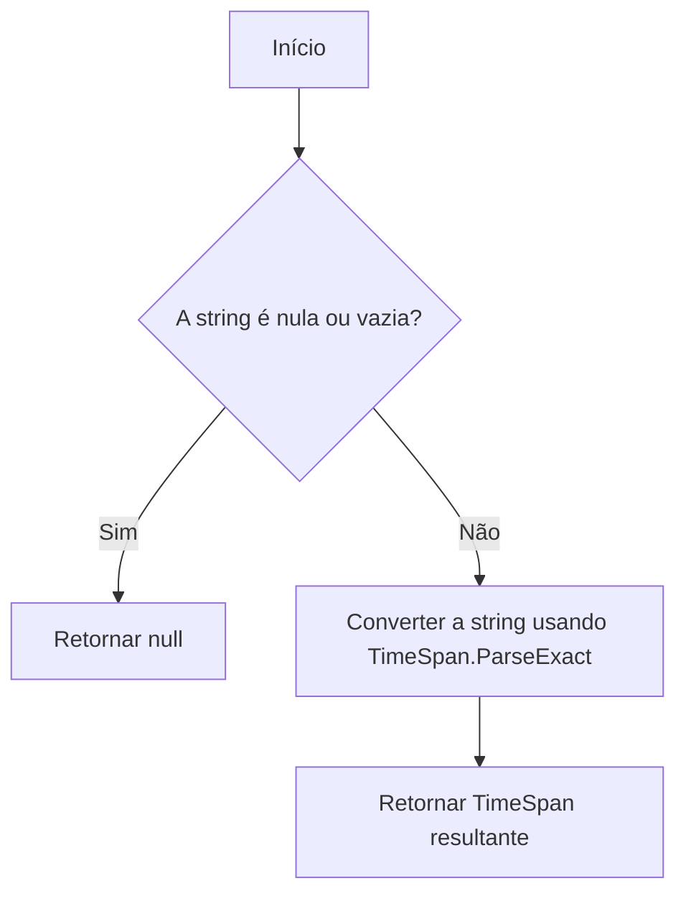
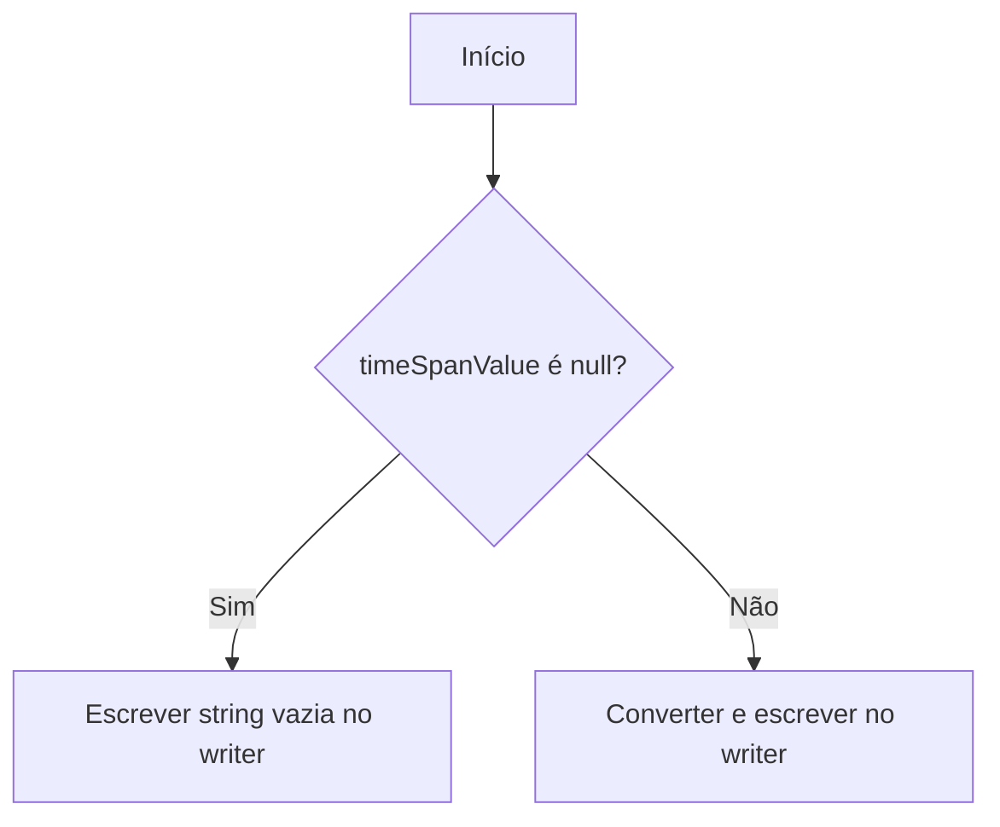
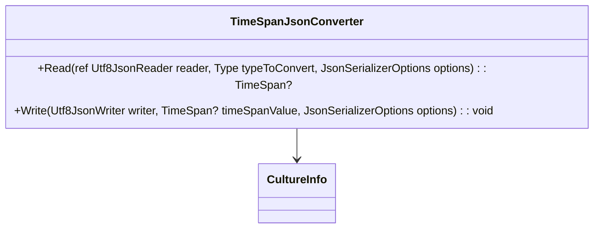

# TimeSpanJsonConverter
**Namespace**: IsthmusWinthor.Dominio.JsonSerializers  
**Nome do Arquivo**: TimeSpanJsonConverter.cs  

## Visão Geral e Responsabilidade
A classe `TimeSpanJsonConverter` é responsável pela serialização e desserialização de valores do tipo `TimeSpan?` para o formato JSON. Ela garante a integridade dos dados ao assegurar que as representações de intervalos de tempo sejam convertidas corretamente entre o formato textual e o formato de dados do aplicativo, abordando a necessidade de intercâmbio de dados na camada de domínio.

## Métodos de Negócio

### 1. Read 
- **Visibilidade**: Public
- **Objetivo**: Garantir que uma string JSON seja convertida para um valor `TimeSpan?` corretamente, respeitando o formato específico de horas, minutos e segundos.
- **Comportamento**:
  1. O método lê uma string do leitor JSON.
  2. Se a string estiver vazia ou nula, retorna null.
  3. Caso contrário, utiliza `TimeSpan.ParseExact` para converter a string no formato @"hh\:mm\:ss".
- **Retorno**: Um valor do tipo `TimeSpan?`. Pode ser null se a string de entrada for vazia ou nula; caso contrário, retorna o `TimeSpan` correspondente.

### 2. Write 
- **Visibilidade**: Public
- **Objetivo**: Converter um valor `TimeSpan?` para uma representação de string JSON, respeitando o formato de horas, minutos e segundos.
- **Comportamento**:
  1. Verifica se o `timeSpanValue` é null.
  2. Se for null, escreve uma string vazia no writer JSON.
  3. Caso contrário, converte `timeSpanValue` para a string no formato @"hh\:mm\:ss" e escreve no writer.
- **Retorno**: Este método não retorna um valor, mas sim escreve diretamente no escritor JSON.

## Propriedades Calculadas e de Validação
- A classe não possui propriedades calculadas ou de validação, uma vez que sua responsabilidade é a conversão e não a modelagem de dados.

## Navigations Property
- A classe `TimeSpanJsonConverter` não possui propriedades de navegação, pois atua apenas como um conversor para o tipo `TimeSpan?`.

## Tipos Auxiliares e Dependências
- Esta classe não possui dependências em Enums ou classes auxiliares complexas, mas utiliza a classe `CultureInfo` do namespace `System.Globalization`.

## Diagrama de Relacionamentos

---
Gerada em 29/12/2025 21:19:08
