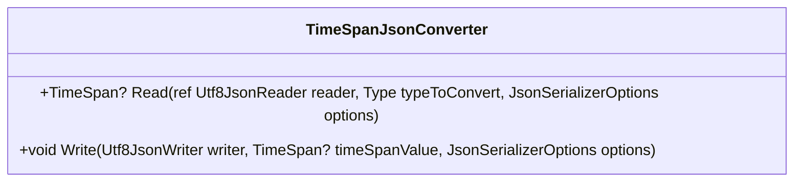

# TimeSpanJsonConverter
- **Namespace**: IsthmusWinthor.Dominio.JsonSerializers
- **Nome do Arquivo**: TimeSpanJsonConverter.cs

Esta classe é responsável pelo processo de leitura e escrita de valores do tipo `TimeSpan?` no formato JSON, atuando como um conversor que facilita a manipulação de dados temporais em objetos JSON.

## Métodos de Negócio

### 1. Read - `public override TimeSpan? Read(...)`
- **Objetivo**: Este método assegura que um valor de `TimeSpan?` pode ser lido corretamente a partir de uma string JSON, interpretando o formato específico de horas, minutos e segundos.
- **Comportamento**:
  1. Verifica se a string lida do `Utf8JsonReader` é nula ou vazia.
  2. Se for, retorna `null`.
  3. Caso contrário, utiliza `TimeSpan.ParseExact` para converter a string lida para um objeto `TimeSpan`, seguindo o formato "hh:mm:ss".
- **Retorno**: Retorna um objeto `TimeSpan?` que representa o valor lido, podendo ser `null` ou uma instância de `TimeSpan`.

### 2. Write - `public override void Write(...)`
- **Objetivo**: Este método garante que um valor de `TimeSpan?` seja escrito no formato apropriado para JSON.
- **Comportamento**:
  1. Verifica se `timeSpanValue` é nulo.
  2. Se for nulo, escreve uma string vazia no JSON.
  3. Caso contrário, transforma o `TimeSpan` em string no formato "hh:mm:ss" e escreve no JSON.
- **Retorno**: Não retorna nenhum valor, mas modifica o JSON escrita no `Utf8JsonWriter`.

## Propriedades Calculadas e de Validação
Não há propriedades com lógica de cálculo ou validação a serem descritas nesta classe.

## Navigations Property
Não há propriedades do domínio que sejam classes complexas nesta classe.

## Tipos Auxiliares e Dependências
- `CultureInfo`: Utilizada para garantir que a análise do `TimeSpan` ocorra utilizando informações culturais invariantes.
  
## Diagrama de Relacionamentos

