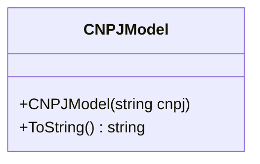

# CNPJModel
**Namespace**: IsthmusWinthor.Dominio.Model  
**Nome do Arquivo**: CNPJModel.cs

## Visão Geral e Responsabilidade
A classe `CNPJModel` é responsável por encapsular a lógica de validação e formatação do Cadastro Nacional da Pessoa Jurídica (CNPJ). Ela garante que um CNPJ seja armazenado em um formato consistente e livre de caracteres não numéricos, solucionando problemas comuns relacionados ao tratamento de CNPJs nas aplicações corporativas.

## Métodos de Negócio

### Título: CNPJModel(string cnpj) - Construtor
- **Objetivo**: Garante que a entrada do CNPJ esteja no formato correto e é limpo de qualquer caracter não numérico.
- **Comportamento**:
  1. Verifica se a string de CNPJ está vazia ou nula.
     - Se estiver, inicializa `_cnpj` com um CNPJ formatado como "00000000000000".
  2. Se a string não for nula, a classe remove os caracteres especiais (pontos, traços, e barras).
  3. Formata a string de CNPJ resultante em um formato padrão de 14 dígitos.
- **Retorno**: Nenhum retorno explícito, mas o CNPJ é armazenado de forma consistente na instância da classe.

### Título: ToString() - Método Público
- **Objetivo**: Retorna a representação textual do CNPJ armazenado.
- **Comportamento**:
  1. Chama o método `ToString` da propriedade `_cnpj` para obter o valor formatado.
  2. Retorna este valor como uma string.
- **Retorno**: Uma string representando o CNPJ formatado.

## Propriedades Calculadas e de Validação
- **Propriedade**: `_cnpj` 
  - **Regra**: A propriedade `_cnpj` é manipulada através de métodos para garantir que o CNPJ seja consistido com a formatação padrão, removendo caracteres inaceitáveis e aplicando a formatação correta.

## Navigations Property
Não há propriedades de navegação complexas nesta classe.

## Tipos Auxiliares e Dependências
Não existem enumeradores ou classes auxiliares que a classe `CNPJModel` utilize, visto que a lógica se concentra totalmente na manipulação do CNPJ.

## Diagrama de Relacionamentos

