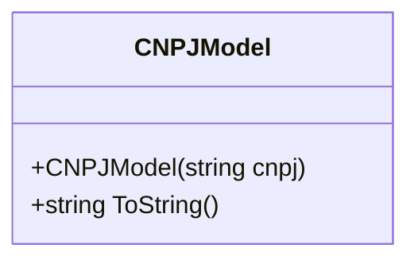

# CNPJModel
**Namespace**: IsthmusWinthor.Dominio.Model  
**Nome do Arquivo**: CNPJModel.cs  

## Visão Geral e Responsabilidade
A classe `CNPJModel` atua como um modelo de domínio para a representação e manipulação de CNPJ (Cadastro Nacional da Pessoa Jurídica). Ela é responsável por garantir a validade, formatação e integridade dos dados do CNPJ fornecido, resolvendo assim o problema de inconsistência e formatação que pode ocorrer ao manipular esse dado tributário essencial para empresas no Brasil.

## Métodos de Negócio
### Título: Constructor e Visibilidade
**Visibilidade**: `public`  
**Objetivo**: Garantir que o CNPJ fornecido seja validado e formatado corretamente ao ser instanciado, removendo caracteres não numéricos e exigindo um formato consistente.

**Comportamento**:
1. O parâmetro `cnpj` é recebido no construtor.
2. Verifica se o `cnpj` é nulo ou vazio. Se for, inicializa o `_cnpj` com um valor padrão formatado como '00000000000000'.
3. Se um CNPJ válido for fornecido, substitui os caracteres ".", "-", e "/" por uma string vazia.
4. Converte a string resultante em um número longo.
5. Formata o número do CNPJ para o padrão '00000000000000' usando o método `Format`.
6. Armazena o `cnpj` formatado na variável de instância `_cnpj`.

**Retorno**: O construtor não possui retorno, mas altera o estado do objeto `CNPJModel`, garantindo que o CNPJ esteja sempre em um formato correto.

### Título: ToString e Visibilidade
**Visibilidade**: `public override`  
**Objetivo**: Fornecer uma representação string do CNPJ formatado.

**Comportamento**:
1. Retorna o valor armazenado em `_cnpj` como string.

**Retorno**: Retorna a representação string do CNPJ em formato limpo e padronizado.

## Propriedades Calculadas e de Validação
- **Propriedade**: `_cnpj`
  - A propriedade `_cnpj` armazena o CNPJ de forma que sua formatação e integridade sejam garantidas. Não há validações diretas em `get` ou `set`, pois o CNPJ é formatado corretamente no construtor.

## Navigations Property
- Não existem propriedades que sejam classes complexas do domínio nesta classe.

## Tipos Auxiliares e Dependências
- Nenhum enumerador ou classe estática/helper é utilizado nesta classe.

## Diagrama de Relacionamentos

A classe `CNPJModel` é autônoma e não possui relacionamentos com outras classes ou tipos enumeradores no escopo atualmente fornecido. Adjustes futuros no domínio podem incorformar tais nuances, mas no estado atual, a classe focaliza exclusivamente no tratamento do CNPJ.
---
Gerada em 29/12/2025 21:19:24
