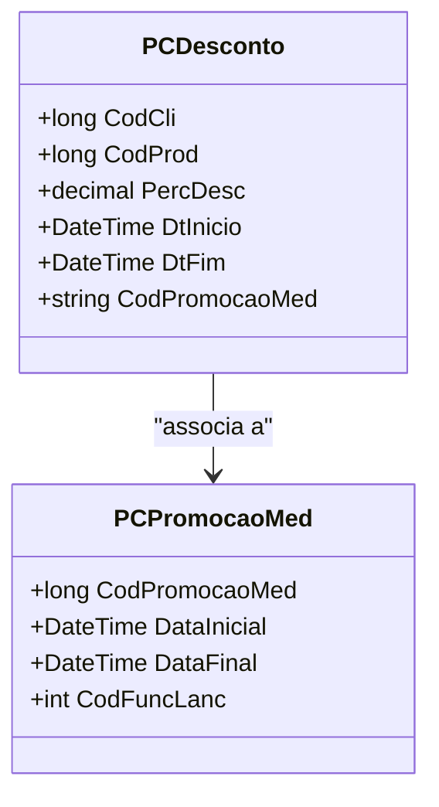

# PCDesconto

**Namespace**: IsthmusWinthor.Dominio.Model.CampanhasWinthor  
**Nome do Arquivo**: PCDesconto.cs  

## Visão Geral e Responsabilidade
A classe `PCDesconto` representa um modelo de desconto para campanhas promocionais. O seu papel principal é gerenciar as regras de aplicação de descontos em produtos, levando em consideração uma série de critérios comerciais como condições de venda, segmentos de clientes e períodos de promoção. Essa classe é crucial para assegurar que os descontos são aplicados de maneira correta e consistente dentro do sistema, garantindo a integridade de dados e a conformidade com as políticas de negócio estabelecidas.

## Métodos de Negócio
*Nota: Esta classe não possui métodos de negócios complexos descritos que contenham lógica além de getters/setters, portanto estamos omitindo essa seção.*

## Propriedades Calculadas e de Validação
* As propriedades em `PCDesconto` são majoritariamente campos imutáveis fornecidos na construção da entidade, sem lógica de validação interna explícita nos getters ou anotações. Algumas propriedades que são importantes incluem:
  - `PercDesc`: Armazena a porcentagem de desconto que deve ser aplicada, essencial para o cálculo do preço final do produto.
  - `DtInicio` e `DtFim`: Definem o período de validade da promoção.
  - `Prioritaria`: Indica se a promoção tem natureza prioritária.

## Navigation Property
- `PCPromocaoMed`: [PCPromocaoMed](PCPromocaoMed.md) - Representa a promoção associada ao desconto, contendo informações fundamentais como o código da promoção e suas datas de início e fim.

## Tipos Auxiliares e Dependências
- **Enums**: A classe pode utilizar enums relacionados a tipos de desconto ou status de promoção, embora não estejam explicitamente mostrados no código.
- **Classes Estáticas/Helpers**: É possível que haja classes auxiliares dentro do mesmo namespace que facilitam operações relacionadas a campanhas e promocoes, mas especificamente não estão declaradas no código fornecido.

## Diagrama de Relacionamentos

Este documento oferece uma visão abrangente das responsabilidades e estrutura da classe `PCDesconto`, incluindo o modelo de dados, suas propriedades essenciais e a relação com outras classes do domínio.
---
Gerada em 29/12/2025 21:20:00
