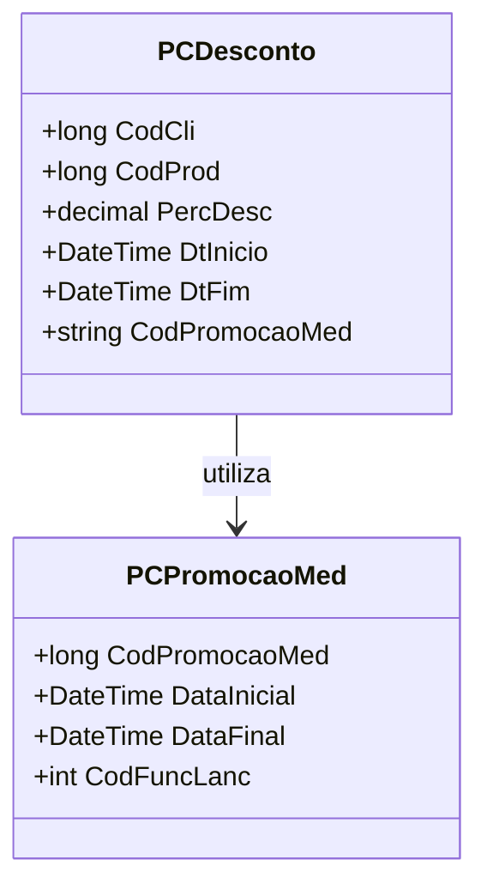

# PCDesconto
**Namespace**: IsthmusWinthor.Dominio.Model.CampanhasWinthor  
**Nome do Arquivo**: PCDesconto.cs

## Visão Geral e Responsabilidade
A classe `PCDesconto` é responsável por encapsular as informações e regras associadas a um desconto aplicado em campanhas promocionais dentro do sistema. Ela gerencia propriedades essenciais para a definição de um desconto, como percentuais e datas de início e fim, e assegura que as condições necessárias para a aplicação do desconto sejam atendidas. O problema de negócio que esta classe resolve é a administração de políticas de desconto, garantindo que os descontos sejam atribuídos de forma consistente e conforme as regras estabelecidas, impactando diretamente na lucratividade e nas vendas.

## Métodos de Negócio
- **Título**: `PCDesconto()`, `public`
  - **Objetivo**: Garantir que a criação de um desconto esteja sempre associada a uma promoção válida e que todos os campos necessários sejam inicializados corretamente.
  - **Comportamento**:
    1. O construtor recebe um objeto `PCPromocaoMed` e inicializa os valores das propriedades relacionadas, como códigos de promoção, datas e percentual de desconto.
    2. A classe assume os valores dos parâmetros fornecidos, assegurando que estão dentro dos limites definidos na promoção.
  - **Retorno**: Não há retorno, pois trata-se de um construtor.

## Propriedades Calculadas e de Validação
- Nenhuma propriedade na classe `PCDesconto` contém lógica de cálculo ou validação em seus getters ou setters que exija documentação adicional sob este item.

## Navigation Properties
- `[PCPromocaoMed](PCPromocaoMed.md)`: Representa a promoção associada ao desconto.

## Tipos Auxiliares e Dependências
- Nenhum enumerador ou classe estática/helper é utilizado diretamente na classe `PCDesconto`.

## Diagrama de Relacionamentos

