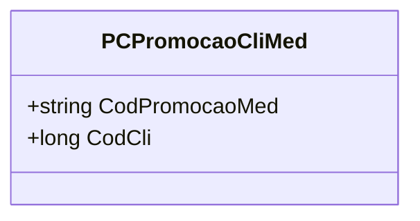

# PCPromocaoCliMed
**Namespace**: IsthmusWinthor.Dominio.Model.CampanhasWinthor  
**Nome do Arquivo**: PCPromocaoCliMed.cs  

A classe `PCPromocaoCliMed` é responsável por representar a associação entre uma promoção médica (`CodPromocaoMed`) e um cliente (`CodCli`). Este modelo é um Rich Domain Model, considerando que não apenas transporta dados, mas também infere uma relação de negócios importante entre os dois elementos.

## Visão Geral e Responsabilidade
A classe `PCPromocaoCliMed` encapsula a lógica de identificação única de uma promoção médica específica aplicável a um determinado cliente. O papel principal dessa classe é garantir que a ligação entre os códigos de promoção e cliente seja claramente definida, promovendo a integridade dos dados no contexto de campanhas de promoção dirigidas aos clientes.

## Métodos de Negócio
- **Título**: Construtor (public)
  - **Objetivo**: Este método garante que a instância de promoção médica e cliente seja criada com informações obrigatórias, prevenindo a criação de objetos sem dados válidos.
  - **Comportamento**: 
    1. Recebe os parâmetros `codPromocaoMed` e `codCli`.
    2. Atribui os valores dos parâmetros às propriedades imutáveis `CodPromocaoMed` e `CodCli`.
  - **Retorno**: Não retorna um valor, mas resulta em uma instância consistente de `PCPromocaoCliMed`.

## Propriedades Calculadas e de Validação
A classe não contém propriedades que possuam lógica no `get` ou validação no `set`. Todas as propriedades são imutáveis e são definidas apenas no construtor.

## Navigation Property
A classe `PCPromocaoCliMed` não possui navegações complexas para outras classes dentro do domínio, dado que se destina a ser uma entidade simples para relações.

## Tipos Auxiliares e Dependências
- Esta classe não depende de quaisquer enumeradores (Enums) ou classes estáticas/helpers. É uma classe autônoma sem referências externas.

## Diagrama de Relacionamentos

---
Gerada em 29/12/2025 21:20:11
