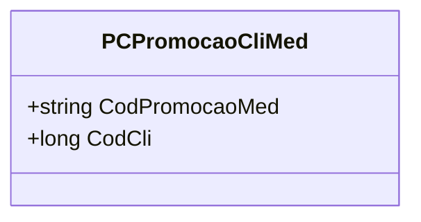

# PCPromocaoCliMed
**Namespace**: IsthmusWinthor.Dominio.Model.CampanhasWinthor  
**Nome do Arquivo**: PCPromocaoCliMed.cs  

### Visão Geral e Responsabilidade
A classe `PCPromocaoCliMed` atua como um modelo de domínio que representa uma promoção vinculada a um cliente. O principal objetivo dessa classe é garantir que as informações sobre códigos de promoção e cliente estejam associadas corretamente, assegurando a integridade e a validação dos dados no contexto de campanhas promocionais.

### Métodos de Negócio
- **Título**: Construtor `PCPromocaoCliMed` (Visibilidade: `public`)
  - **Objetivo**: O construtor assegura que uma instância da classe `PCPromocaoCliMed` é criada de forma que os valores de `CodPromocaoMed` e `CodCli` sejam obrigatoriamente fornecidos, evitando a criação de objetos inválidos.
  - **Comportamento**: 
    1. Recebe como parâmetros `codPromocaoMed` e `codCli`.
    2. Atribui esses valores às propriedades correspondentes `CodPromocaoMed` e `CodCli`.
    3. As propriedades são somente leitura, garantindo que uma vez que a instância é criada, os valores não podem ser alterados.
  - **Retorno**: Não possui retorno, mas resulta na criação de um novo objeto `PCPromocaoCliMed` válido.

### Propriedades Calculadas e de Validação
- Não há propriedades com lógica de cálculo ou validação no `get` ou no `set`.

### Navigations Property
- Neste caso, não existem propriedades que representem classes complexas do domínio.

### Tipos Auxiliares e Dependências
- Não há enumeradores, classes auxiliares ou helpers utilizados na classe `PCPromocaoCliMed`.

### Diagrama de Relacionamentos

Na classe `PCPromocaoCliMed`, as propriedades são representações diretas dos dados de promoção e cliente, sem dependências externas ou associações complexas, refletindo uma estrutura de dados simples alinhada ao modelo de domínio.
