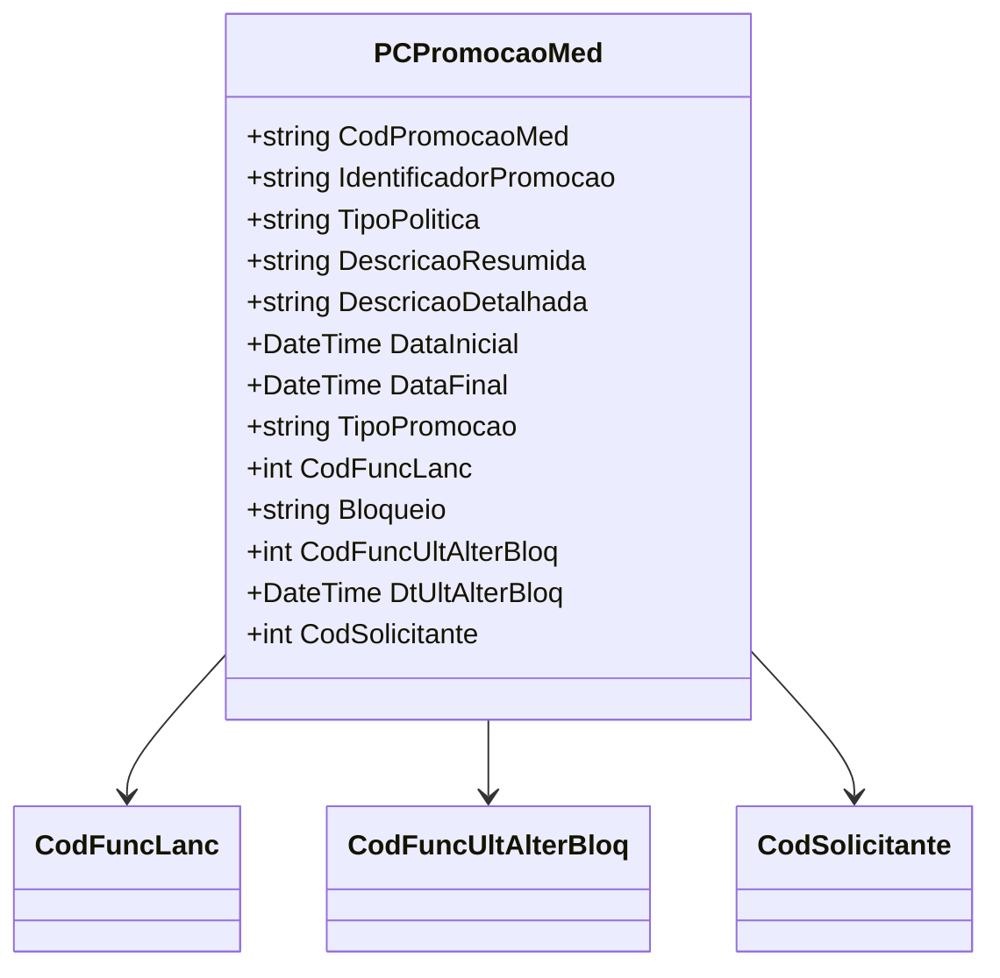

# PCPromocaoMed

**Namespace**: IsthmusWinthor.Dominio.Model.CampanhasWinthor  
**Nome do Arquivo**: PCPromocaoMed.cs  

## Visão Geral e Responsabilidade
A classe `PCPromocaoMed` representa uma promoção médica, que possui uma validade pré-definida e uma série de atributos específicos relacionados ao gerenciamento de promoções dentro de um sistema corporativo. Esta classe é fundamental para o gerenciamento eficiente das operações promocionais, assegurando que as regras de negócio sejam seguidas, como a validade das promoções e as restrições associadas a elas.

## Métodos de Negócio
### Método: Construtor `PCPromocaoMed` (public)
**Objetivo**: Este método garante a criação de uma nova instância de promoção médica com as informações necessárias para identificação e condição de uso da promoção.

**Comportamento**:
1. Inicializa a data inicial como o dia atual.
2. Define a data final adicionando 7 dias à data inicial, estabelecendo o período de validade da promoção.
3. Atribui os parâmetros de descrição resumida e detalhada fornecidos, assim como o código do funcionário responsável pela criação da promoção.
4. Define as propriedades de identificação, tipo, e as regras padrão da promoção.

**Retorno**: Este método não retorna valor, mas cria uma instância da promoção médica com as propriedades definidas.

## Propriedades Calculadas e de Validação
- **IdentificadorPromocao**: Identifica a promoção utilizando um valor fixo "WVERB".
- **DataFinal**: Cálculo baseado na data atual e no período de validade definido.

## Navigation Property
- `CodFuncLanc`: O código do funcionário que lançou a promoção.
- `CodFuncUltAlterBloq`: O código do funcionário responsável pela última alteração que bloqueou a promoção.
- `CodSolicitante`: O código do funcionário solicitante da promoção.

## Tipos Auxiliares e Dependências
- Enumeradores e Classes Auxiliares não especificadas diretamente no código, mas a classe depende do sistema que a envolvem, como gerenciamento de promoções e usuários.

## Diagrama de Relacionamentos

---
Gerada em 29/12/2025 21:20:24
