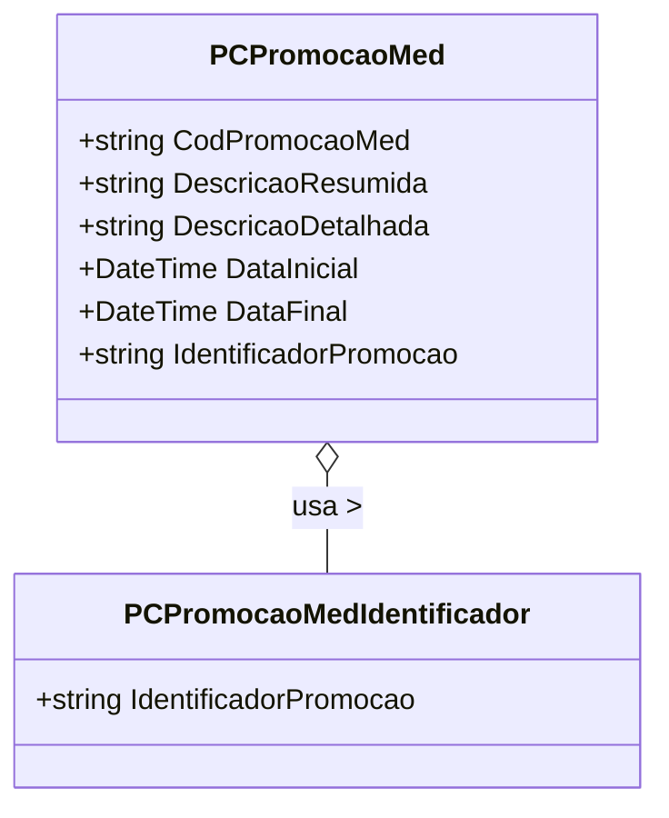

# PCPromocaoMed

- **Namespace**: IsthmusWinthor.Dominio.Model.CampanhasWinthor
- **Nome do Arquivo**: PCPromocaoMed.cs

## Visão Geral e Responsabilidade
A classe `PCPromocaoMed` representa uma promoção no sistema, gerenciando as informações relacionadas a campanhas promocionais específicas. Ela define as regras para a criação, validade e características de uma promoção, permitindo que o sistema gerencie promoções de forma coerente e controlada. O principal problema de negócio que ela resolve é a necessidade de ter uma estrutura organizada e validada para campanhas promocionais, garantindo que os dados estejam corretos e as promoções sigam as regras predefinidas.

## Métodos de Negócio

### `PCPromocaoMed(string descricaoResumida, string descricaoDetalhada, int codigoFuncionario)`
- **Objetivo**: Inicializa uma nova instância da promoção médica com os detalhes básicos e a data de validade da promoção.
- **Comportamento**:
  1. Define a data inicial da promoção como a data atual.
  2. Adiciona 7 dias à data inicial para definir a data final da promoção.
  3. Atribui as descrições, código do funcionário e as datas para as propriedades correspondentes.
  4. Inicializa o identificador da promoção como um valor fixo definido na classe `PCPromocaoMedIdentificador`.
- **Retorno**: A classe não retorna um valor, mas cria uma nova instância da promoção com as propriedades definidas.

### `ValidarIntervaloValidadeProd`
**Nota**: A propriedade `ValidarIntervaloValidadeProd` parece estar pendente de implementação, não há lógica explícita descrita no código fornecido.

## Propriedades Calculadas e de Validação
- `DataFinal`: Esta propriedade é calculada a partir `DataInicial` adicionando um período fixo de 7 dias. Isso garante que a promoção tenha um período de validade bem definido.
  
## Navigations Property
Não há propriedades que sejam classes complexas do domínio nesta classe.

## Tipos Auxiliares e Dependências
- `[PCPromocaoMedIdentificador](PCPromocaoMedIdentificador.md)`: Classe auxiliar que define o identificador da promoção médica.

## Diagrama de Relacionamentos

