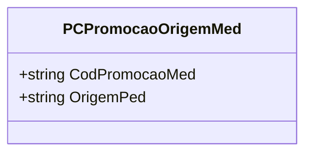

# PCPromocaoOrigemMed
- **Namespace**: IsthmusWinthor.Dominio.Model.CampanhasWinthor
- **Nome do Arquivo**: PCPromocaoOrigemMed.cs

## Visão Geral e Responsabilidade
A classe `PCPromocaoOrigemMed` representa a origem de uma promoção utilizada em um sistema de gestão de campanhas. Seu papel é garantir que cada promoção esteja associada a um código único e a uma origem definida. Isso é essencial para a integridade dos dados nas operações relacionadas a promoções, permitindo o rastreamento e a gestão efetiva das campanhas.

## Métodos de Negócio
### Construtor: PCPromocaoOrigemMed
- **Objetivo**: Estabelece um código de promoção médico válido na criação da instância da classe.
- **Comportamento**: 
  1. Recebe um parâmetro `codPromocaoMed` que deve ser uma representação válida do código da promoção.
  2. Atribui o valor do parâmetro à propriedade `CodPromocaoMed`.
- **Retorno**: Não retorna valor, pois é um construtor. 

## Propriedades Calculadas e de Validação
- `CodPromocaoMed`: A propriedade `CodPromocaoMed` é uma informação essencial que deve ser fornecida no momento da criação do objeto. Não possui validações adicionais.
- `OrigemPed`: A propriedade `OrigemPed` é sempre definida como "W" e não permite modificações externas.

## Navigations Property
- Nenhuma propriedade complexa do domínio (navegação) foi identificada nesta classe.

## Tipos Auxiliares e Dependências
- Não há enumeradores ou classes estáticas/helper utilizadas diretamente nesta classe.

## Diagrama de Relacionamentos

---
Gerada em 29/12/2025 21:20:34
