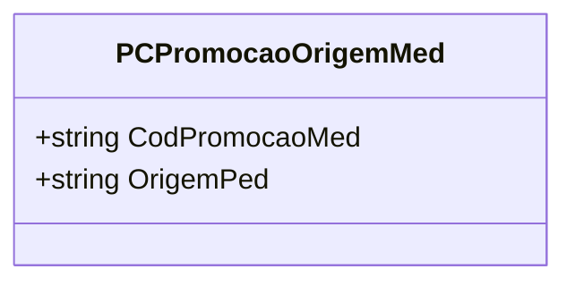

# PCPromocaoOrigemMed
**Namespace**: IsthmusWinthor.Dominio.Model.CampanhasWinthor  
**Nome do Arquivo**: PCPromocaoOrigemMed.cs  

## Visão Geral e Responsabilidade
A classe `PCPromocaoOrigemMed` representa uma origem associada a uma promoção médica dentro do sistema. Seu principal papel é encapsular as informações da promoção, especificamente o código da promoção médica e a sua origem de pedido. Essa estrutura é fundamental para assegurar que as promoções sejam corretamente atribuídas e rastreadas, garantindo que processos comerciais correspondam às regras de origem aplicáveis.

## Métodos de Negócio
### Título: PCPromocaoOrigemMed (Construtor)
- **Objetivo**: Garantir que uma instância da promoção contenha um código válido para a promoção médica.
- **Comportamento**: Ao instanciar a classe, o construtor exige que um código de promoção médica (`codPromocaoMed`) seja passado como parâmetro. Isso assegura que todas as instâncias da promoção tenham um código válido desde o momento de sua criação.
- **Retorno**: Não possui retorno, mas lança exceção se o código fornecido for inválido (considerando a lógica não implementada, que poderia ser adicionada para validar o código).

## Propriedades Calculadas e de Validação
- **OrigemPed**: Esta propriedade tem valor fixo "W", o que indica que a promoção origina-se de um pedido padrão na interface do sistema.
- **CodPromocaoMed**: Não possui lógica de validação específica, mas é essencial que o código fornecido no construtor seja sempre válido, o que pode ser considerado uma validação de domínio.

## Navigation Property
- Não há propriedades que representem classes complexas do domínio nesta classe.

## Tipos Auxiliares e Dependências
- Não há Enumeradores ou Classes Estáticas/Helpers utilizadas por esta classe.

## Diagrama de Relacionamentos

