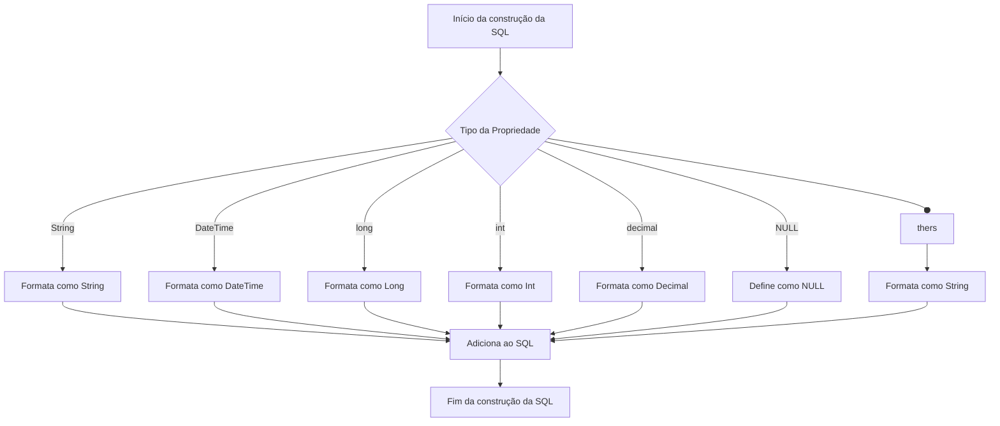
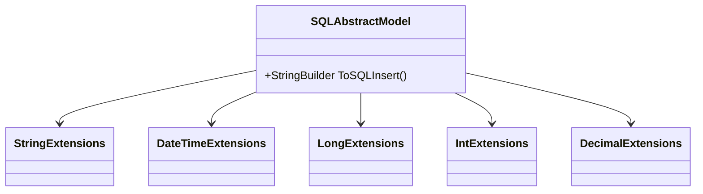

# SQLAbstractModel

**Namespace**: IsthmusWinthor.Dominio.Model.CampanhasWinthor  
**Nome do Arquivo**: SQLAbstractModel.cs  

## Visão Geral e Responsabilidade
A classe `SQLAbstractModel` é uma classe abstrata na camada de domínio responsável por facilitar a construção de comandos SQL para inserção de dados em tabelas de banco de dados. Ela resolve o problema de consistência e padronização na geração de queries SQL, fornecendo um método que automatiza a criação de instruções `INSERT` com base nas propriedades do objeto, permitindo que subclasse possam herdar e implementar modelos de dados específicos.

## Métodos de Negócio

### Título: ToSQLInsert — Visibilidade: Public
- **Objetivo**: Garante a criação de uma instrução SQL `INSERT` válida para a persistência de dados no banco de dados baseado nas propriedades da subclasse.
  
- **Comportamento**: 
  1. Inicializa um `StringBuilder` para construir a instrução SQL.
  2. Obtém o tipo da classe atual e suas propriedades por reflexão.
  3. Adiciona a cláusula `INSERT INTO` com o nome da tabela.
  4. Para cada propriedade do objeto:
     - Se necessário, adiciona vírgulas para separar os nomes das colunas.
     - Adiciona o nome da propriedade à instrução SQL.
     - Para cada valor da propriedade, aplica a conversão para o formato correto de acordo com o tipo (string, DateTime, long, int, decimal, etc.) ou define como `NULL` se o valor for nulo.
  5. Finaliza a instrução SQL com a cláusula `VALUES` e os valores formatados correspondentes.
  
- **Retorno**: Retorna um `StringBuilder` contendo a instrução SQL `INSERT`, pronta para ser utilizada na execução da inserção no banco de dados.

## Propriedades Calculadas e de Validação
Esta classe não contém propriedades que realizam cálculos ou validações no `get` ou `set`.

## Navigations Property
Esta classe não possui propriedades que são instâncias de classes complexas do domínio.

## Tipos Auxiliares e Dependências
- Classes de Extensão:
  - [StringExtensions](StringExtensions.md)
  - [DateTimeExtensions](DateTimeExtensions.md)
  - [LongExtensions](LongExtensions.md)
  - [IntExtensions](IntExtensions.md)
  - [DecimalExtensions](DecimalExtensions.md)

## Diagrama de Relacionamentos

---
Gerada em 29/12/2025 21:20:52
