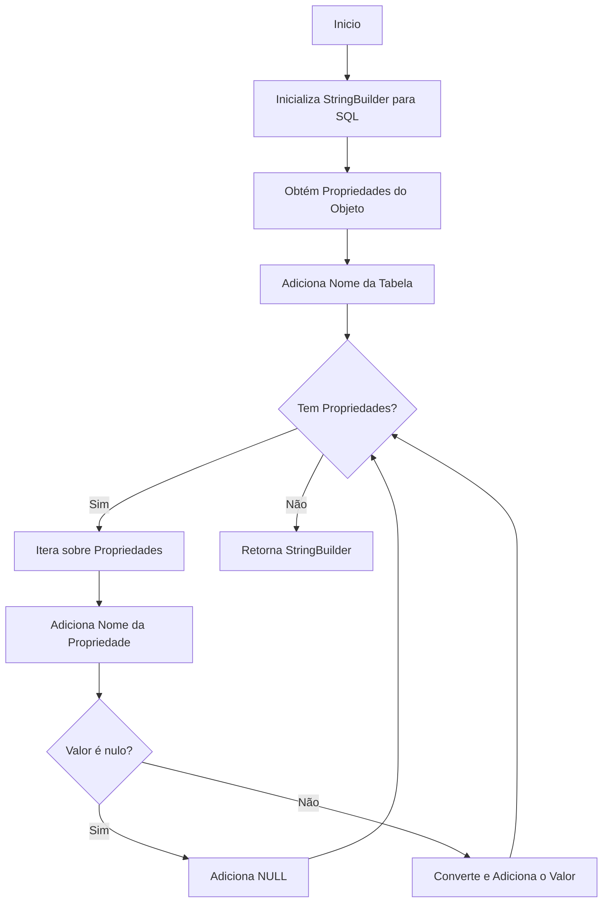
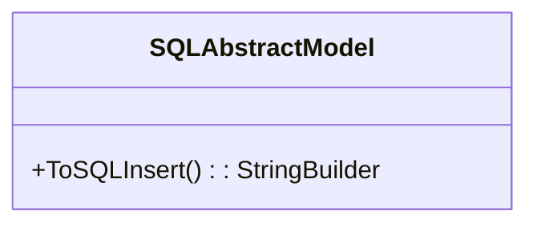

# SQLAbstractModel
**Namespace**: IsthmusWinthor.Dominio.Model.CampanhasWinthor  
**Nome do Arquivo**: SQLAbstractModel.cs  

## Visão Geral e Responsabilidade
A classe `SQLAbstractModel` atua como uma base para modelos que necessitam gerar operações SQL de inserção de dados em um banco de dados, especificamente formulando comandos SQL na forma de strings. Ela visa facilitar a criação dinâmica de comandos de inserção, abstraindo a complexidade da manipulação de propriedades do modelo e suas conversões correspondentes para o formato SQL. O problema de negócio que esta classe resolve está relacionado com a necessidade de um meio eficiente e consistente para inserir dados em tabelas, evitando a repetição de código nas subclasses.

## Métodos de Negócio

### Título: ToSQLInsert e Visibilidade: public
- **Objetivo**: Garante a criação de um comando SQL de inserção com base nas propriedades do modelo, independentemente do tipo de dado.
- **Comportamento**: 
  1. Inicializa um `StringBuilder` para compor a consulta SQL.
  2. Obtém as propriedades do objeto usando reflexão.
  3. Adiciona o nome da tabela ao comando SQL.
  4. Itera sobre cada propriedade, construindo a lista de colunas e valores correspondentes. 
  5. Formata valores considerando o tipo (string, DateTime, long, int, decimal) ou insere `NULL` se o valor for nulo.
  6. Constrói e retorna a string final do comando SQL.
- **Retorno**: Retorna um `StringBuilder` que contém a consulta SQL de inserção formatada.

## Propriedades Calculadas e de Validação
Não existem propriedades com lógica de cálculo ou validação nesta classe, pois seu propósito principal é apenas a geração do comando SQL.

## Navigations Property
Não há propriedades que sejam classes complexas do domínio nesta classe.

## Tipos Auxiliares e Dependências
- Extendendo a funcionalidade de conversão de tipos, a classe utiliza métodos de extensão como `ToOracleString()`, `ToOracleDateTime()`, `ToOracleLong()`, `ToOracleInt()`, e `ToOracleDecimal()`.  
  Links para os tipos associados devem ser encontrados nas respectivas definições de métodos de extensão.

## Diagrama de Relacionamentos

Neste diagrama, `SQLAbstractModel` é a única classe representada, visto que não possui propriedades complexas ou relações explícitas com outras classes ou enums.
