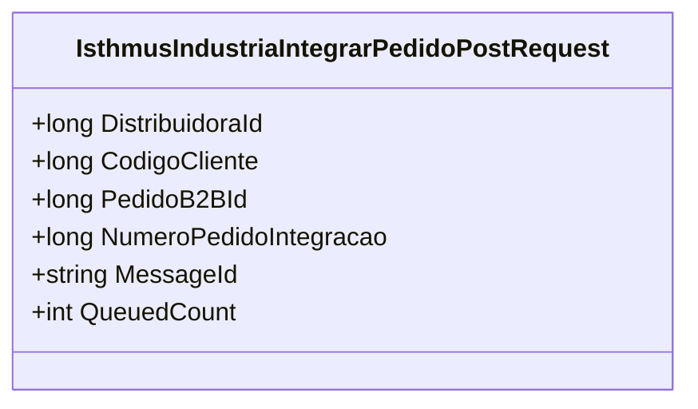

# IsthmusIndustriaIntegrarPedidoPostRequest
**Namespace**: IsthmusWinthor.Dominio.Model  
**Nome do Arquivo**: IsthmusIndustriaIntegrarPedidoPostRequest.cs  

A classe `IsthmusIndustriaIntegrarPedidoPostRequest` serve como um objeto de transporte para mensagens em uma fila de integração de pedidos na indústria, encapsulando as informações necessárias para a transmissão e a identificação de um pedido.

## Métodos de Negócio
### Título: Construtor (`public IsthmusIndustriaIntegrarPedidoPostRequest()`)
- **Objetivo**: Inicializar um novo objeto de requisição para a integração de pedidos, garantindo que a contagem de filas e o ID da mensagem sejam definidas de maneira padrão.
- **Comportamento**: 
  1. O construtor é chamado para criar uma nova instância.
  2. A propriedade `QueuedCount` é definida como 1, indicando que a mensagem foi colocada na fila uma vez.
  3. O `MessageId` é gerado de forma única utilizando `Guid.NewGuid().ToString()` para assegurar a singularidade da mensagem.
- **Retorno**: O construtor não retorna um valor, mas inicializa a instância da classe com as propriedades padrão.

## Propriedades Calculadas e de Validação
- Não existem propriedades com lógica de cálculo ou validação complexa, uma vez que todas as propriedades são simples (anêmicas).

## Navigation Properties
- A classe não possui Navigation Properties relacionadas a outras classes do domínio.

## Tipos Auxiliares e Dependências
- Nenhum enumerador ou classe auxiliar está sendo utilizado diretamente nesta classe.

## Diagrama de Relacionamentos

Esta documentação tem como foco fornecer uma visão clara da classe `IsthmusIndustriaIntegrarPedidoPostRequest`, não apenas em termos de suas propriedades, mas enfatizando as regras de negócio que ela representa, mesmo numa estrutura simples como um objeto de transporte.
