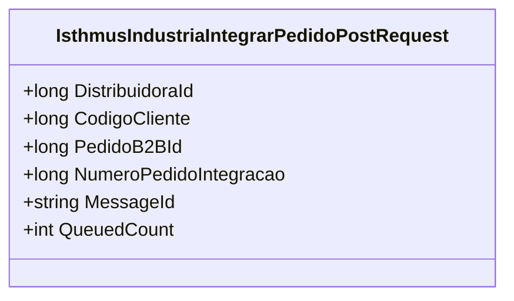

# IsthmusIndustriaIntegrarPedidoPostRequest
**Namespace**: IsthmusWinthor.Dominio.Model  
**Nome do Arquivo**: IsthmusIndustriaIntegrarPedidoPostRequest.cs  

### Visão Geral e Responsabilidade
A classe `IsthmusIndustriaIntegrarPedidoPostRequest` representa uma mensagem que encapsula informações necessárias para integrar um pedido em um sistema de B2B. Ela é responsável por facilitar a comunicação entre diferentes sistemas, garantindo que detalhes críticos do pedido sejam transmitidos de forma estruturada e com identificação única, o que ajuda na robustez do sistema e na integração entre plataformas.

### Métodos de Negócio
Nesta classe, não existem métodos de negócio com lógica condicional ou complexidade, já que ela atua como um DTO. A única lógica presente está na inicialização dos valores padrão no construtor.

### Propriedades Calculadas e de Validação
Esta classe não possui propriedades com lógica de cálculo no `get` ou validação no `set`. Todas as propriedades são do tipo "anêmico".

### Navigations Property
Esta classe não possui propriedades que são classes complexas do domínio.

### Tipos Auxiliares e Dependências
Não há enumeradores ou classes estáticas/helpers utilizados nesta classe.

### Diagrama de Relacionamentos

Esta documentação resume a responsabilidade e a estrutura da classe `IsthmusIndustriaIntegrarPedidoPostRequest`, conforme as diretrizes apresentadas. Como essa classe é essencialmente um DTO, não há complexidade adicional a ser abordada.
---
Gerada em 29/12/2025 21:19:32
