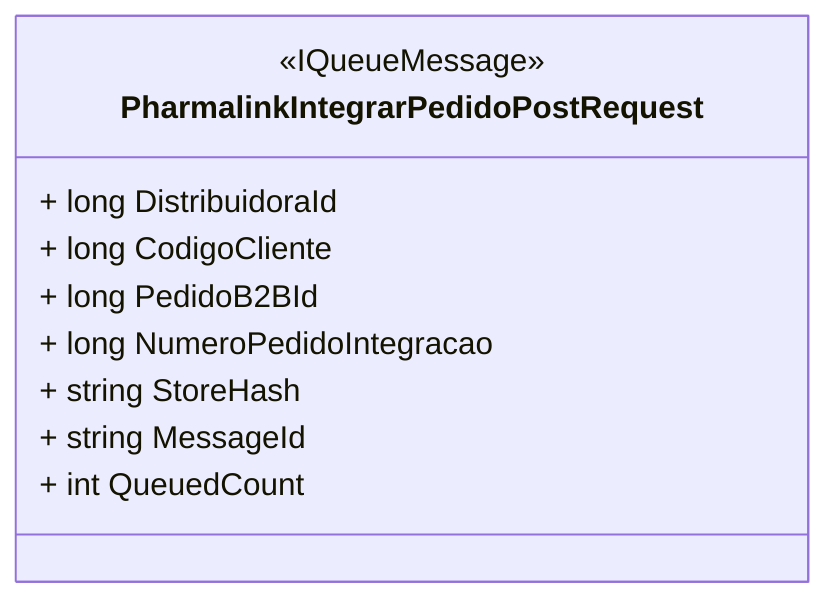

# PharmalinkIntegrarPedidoPostRequest
**Namespace**: IsthmusWinthor.Dominio.Model  
**Nome do Arquivo**: PharmalinkIntegrarPedidoPostRequest.cs  

## Visão Geral e Responsabilidade
A classe `PharmalinkIntegrarPedidoPostRequest` serve como um modelo de requisição para integrar pedidos no sistema Pharmalink. Sua principal responsabilidade é encapsular os dados necessários para enviar informações de pedidos integrados de forma estruturada, garantindo a integridade dos dados a serem processados na fila de mensagens do sistema.

## Métodos de Negócio
Não há métodos com lógica de negócio complexa nesta classe, sendo ela um modelo de dados simples para transporte.

## Propriedades Calculadas e de Validação
Não há propriedades com lógica de cálculo ou validação.

## Navigations Property
Não existem propriedades complexas do domínio nesta classe.

## Tipos Auxiliares e Dependências
Não existem enumeradores ou classes auxiliares que esta classe utilize.

## Diagrama de Relacionamentos

---
Gerada em 29/12/2025 21:19:40
