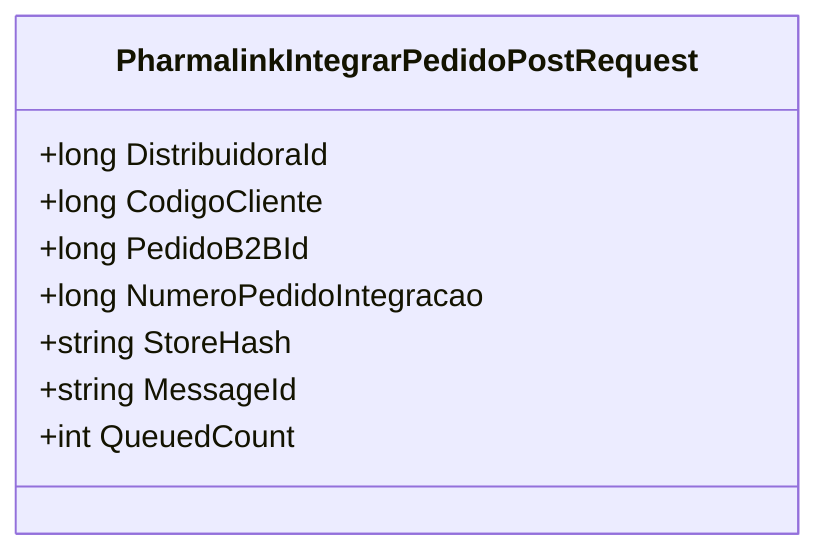

# PharmalinkIntegrarPedidoPostRequest
**Namespace**: IsthmusWinthor.Dominio.Model  
**Nome do Arquivo**: PharmalinkIntegrarPedidoPostRequest.cs  

A classe `PharmalinkIntegrarPedidoPostRequest` tem a finalidade de transportar informações necessárias para a integração de pedidos entre sistemas, encapsulando dados relevantes que serão enviados para a fila de mensagens.

## Métodos de Negócio
### Título: Construtor (public)
**Objetivo:** Este método garante a inicialização dos valores padrão da classe, essencial para o correto funcionamento da aplicação ao criar um novo pedido.  
**Comportamento:** 
1. Define `QueuedCount` como 1, indicando que a mensagem foi enfileirada uma vez.
2. Gera um novo `MessageId` tornando-a única, utilizando o `Guid.NewGuid()`.  
**Retorno:** Não retorna um valor, pois é um construtor.

## Propriedades Calculadas e de Validação
Não há propriedades com lógica de cálculo ou validação nesta classe, todas as propriedades são simples e não realizam operações adicionais em seus getters/setters.

## Navigations Property
Não existem propriedades que são classes complexas do domínio dentro desta classe.

## Tipos Auxiliares e Dependências
Não há tipos auxiliares ou dependências externas que sejam utilizados diretamente por esta classe.

## Diagrama de Relacionamentos

Essa documentação sintetiza o papel da classe `PharmalinkIntegrarPedidoPostRequest`, enfatizando suas responsabilidades na movimentação de dados entre sistemas, de maneira limpa e profissional.
