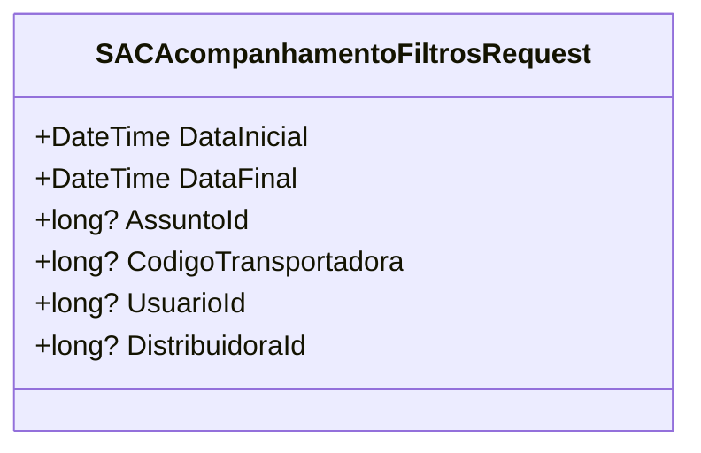

# SACAcompanhamentoFiltrosRequest
**Namespace**: IsthmusWinthor.Dominio.Model  
**Nome do Arquivo**: SACAcompanhamentoFiltrosRequest.cs  

## Visão Geral e Responsabilidade
A classe `SACAcompanhamentoFiltrosRequest` é responsável por encapsular os parâmetros de filtro utilizados em requisições relacionadas ao acompanhamento de uma SAC (Serviço de Atendimento ao Cliente). Essa classe permite que o sistema colete informações específicas, como datas e IDs, essenciais para a recuperação de dados de atendimento ao cliente, facilitando a análise e o monitoramento das interações do cliente com a empresa.

## Métodos de Negócio
- **Título**: N/A (sem métodos de negócio implementados).  
  Como a classe é um simples objeto de transporte de dados (DTO), ela não possui métodos de negócio que implementem lógica significativa.

## Propriedades Calculadas e de Validação
- **DataInicial**: O valor padrão é definido como um mês anterior à data atual. Essa propriedade assegura que o início da análise ocorra automaticamente a partir de um período razoável, facilitando as avaliações de desempenho sem necessidade de configuração manual.
- **DataFinal**: O valor padrão é definido como a data atual. Essa escolha garante que as avaliações estejam sempre atualizadas e abranjam o período mais recente.

## Navigations Property
Nenhuma propriedade de navegação foi identificada nesta classe, pois todas as propriedades são simples e não contém referências a outras entidades complexas do domínio.

## Tipos Auxiliares e Dependências
Nenhum enumerador ou classe estática/helper é utilizado por esta classe, o que a torna uma estrutura leve de dados.

## Diagrama de Relacionamentos

Essa representação visual ilustra a estrutura de dados da classe `SACAcompanhamentoFiltrosRequest`, sem associações ou composições com outras classes.
