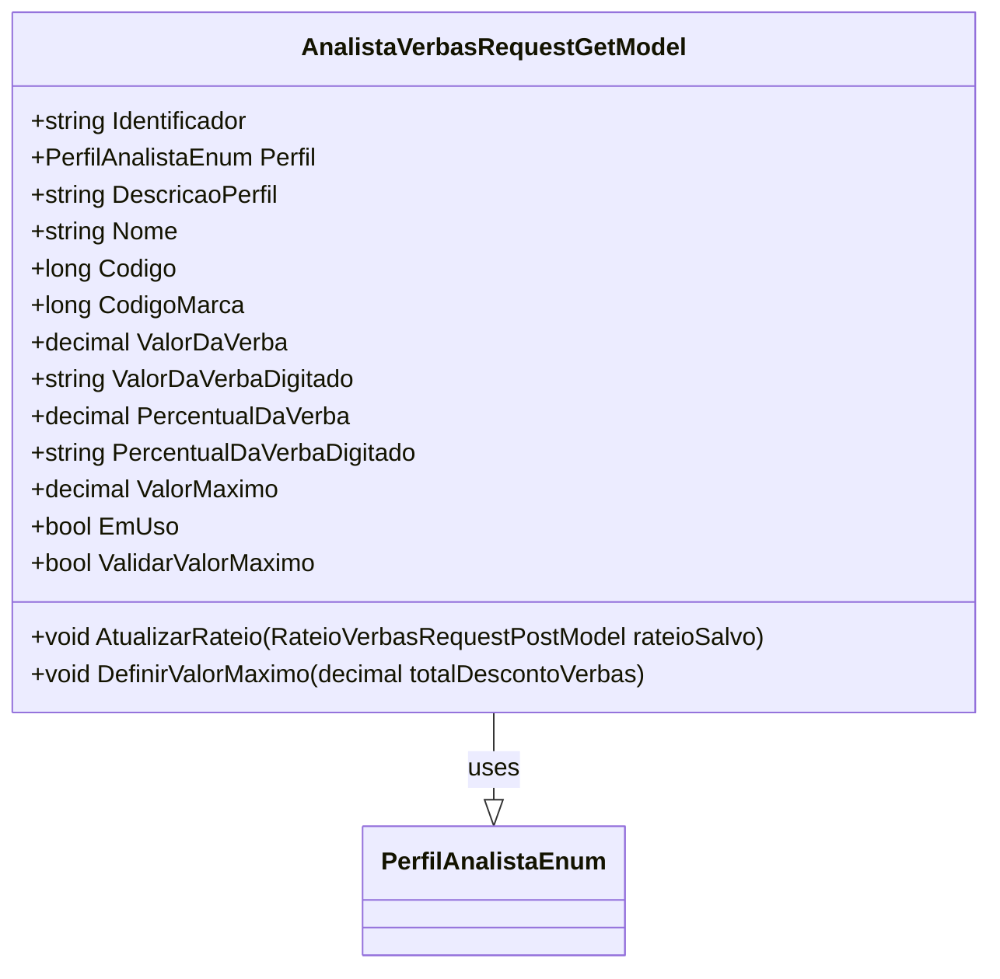

# AnalistaVerbasRequestGetModel
**Namespace**: IsthmusWinthor.Dominio.Model.Verbas  
**Nome do Arquivo**: AnalistaVerbasRequestGetModel.cs  

## Visão Geral e Responsabilidade
A classe `AnalistaVerbasRequestGetModel` atua como um modelo para obter informações sobre verbas associadas a um analista, incluindo detalhes como valor, percentual e perfil do analista. O papel principal desta classe é garantir que os dados referentes às verbas estejam sempre válidos e coerentes, permitindo assim a correta manipulação e apresentação dessas informações no sistema.

## Métodos de Negócio

### AtualizarRateio (public)
- **Objetivo**: Este método atualiza os valores de percentual e valor da verba com base em um objeto de rateio recebido, garantindo que as informações estejam sempre atualizadas e consistentes durante a manipulação dos dados de verbas.
- **Comportamento**: 
  1. O método recebe um parâmetro do tipo `RateioVerbasRequestPostModel`.
  2. Atualiza o atributo `PercentualDaVerba` com o valor fornecido pelo objeto `rateioSalvo`.
  3. Atualiza o atributo `PercentualDaVerbaDigitado` com o respectivo valor do objeto `rateioSalvo`.
  4. Atualiza o atributo `ValorDaVerba` utilizando o valor correspondente no objeto `rateioSalvo`.
  5. Atualiza o atributo `ValorDaVerbaDigitado` com o valor da verba no modelo recebido.

### DefinirValorMaximo (public)
- **Objetivo**: O método define o valor máximo de uma verba com base no total de descontos aplicados, permitindo que o sistema respeite limites estabelecidos na lógica de negócio.
- **Comportamento**: 
  1. Recebe um valor decimal que representa o total de descontos a serem aplicados.
  2. Atribui esse valor ao atributo `ValorMaximo`, permitindo ao sistema utilizar essa definição em cálculos futuros.

## Propriedades Calculadas e de Validação

### `EmUso`
- **Regra**: Esta propriedade calcula se a verba está em uso com base na condição de que o `ValorDaVerba` ou `PercentualDaVerba` sejam maiores que zero. Isso permite a lógica de negócio determinar se a verba está ativa durante operações pertinentes.

### `ValidarValorMaximo`
- **Regra**: Avalia se o perfil do analista é do tipo `Industria` e se o `ValorMaximo` é maior que zero. Esse é um controle que assegura que somente analistas com perfil industrial possam ter um valor máximo definido e válido.

## Navigations Property
Não existem propriedades de navegação nesta classe.

## Tipos Auxiliares e Dependências
- Enumerador: 
  - `[PerfilAnalistaEnum](PerfilAnalistaEnum.md)`

## Diagrama de Relacionamentos

