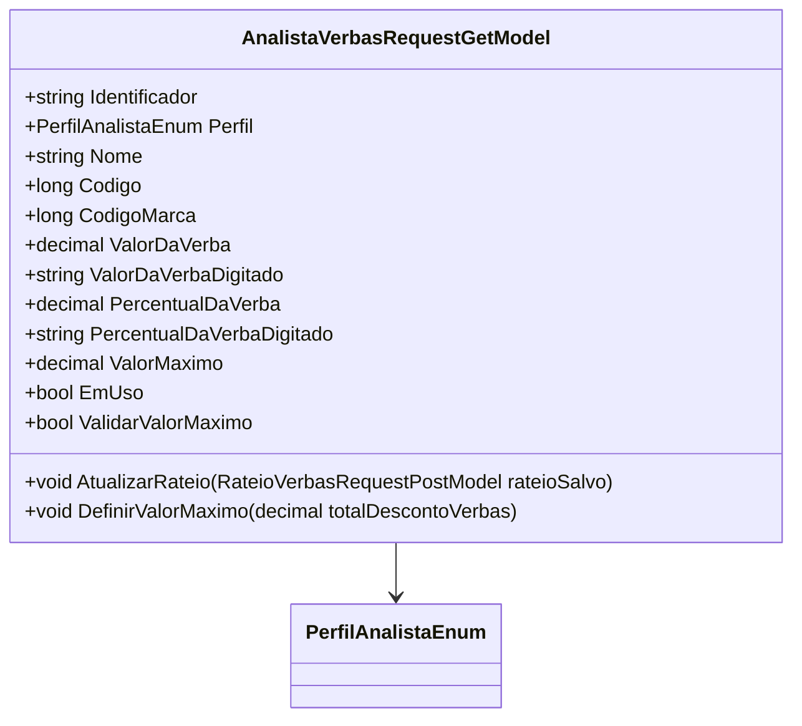

# AnalistaVerbasRequestGetModel
**Namespace**: IsthmusWinthor.Dominio.Model.Verbas  
**Nome do Arquivo**: AnalistaVerbasRequestGetModel.cs  

## Visão Geral e Responsabilidade
A classe `AnalistaVerbasRequestGetModel` tem como objetivo modelar os dados que serão utilizados para representar um analista de verbas em sistemas corporativos. Ela permite a manipulação e a validação de informações relacionadas a percentuais e valores de verbas, garantindo que as regras de negócio para a sua utilização sejam seguidas.

## Métodos de Negócio
### 1. AtualizarRateio (public)
**Objetivo:** Este método atualiza as propriedades relativas ao rateio da verba do analista, garantindo que os dados estejam sempre atualizados com a fonte correta.

**Comportamento:** 
1. O método aceita um parâmetro do tipo `RateioVerbasRequestPostModel`.
2. Ele atualiza a propriedade `PercentualDaVerba` com o valor do rateio fornecido.
3. Atualiza a propriedade `PercentualDaVerbaDigitado` com o valor digitado do rateio.
4. Atualiza a propriedade `ValorDaVerba` com o valor do rateio.
5. Atualiza a propriedade `ValorDaVerbaDigitado` com o valor digitado referente à verba.

**Retorno:** Este método não retorna um valor. Seu propósito é modificar o estado do objeto.

### 2. DefinirValorMaximo (public)
**Objetivo:** Este método define o valor máximo que pode ser atribuído à verba, com base em um total de desconto de verbas informado.

**Comportamento:** 
1. O método recebe um parâmetro `totalDescontoVerbas` do tipo `decimal`.
2. A propriedade `ValorMaximo` é atualizada para o valor recebido como parâmetro.

**Retorno:** Este método não retorna valores. Ele altera diretamente a propriedade `ValorMaximo`.

## Propriedades Calculadas e de Validação
- **EmUso:** Esta propriedade calcula se a verba está em uso, retornando verdadeiro caso `ValorDaVerba` ou `PercentualDaVerba` sejam maiores que zero. Essa lógica é essencial para determinar a necessidade de ações relacionadas à verba.
  
- **ValidarValorMaximo:** Esta propriedade valida se o `Perfil` do analista é do tipo `Industria` e se `ValorMaximo` é maior que zero, assegurando que a regra de negócio de que o valor máximo deve ser positivo para este perfil seja respeitada.

## Navigations Property
- Nenhuma propriedade de navegação foi identificada nesta classe.

## Tipos Auxiliares e Dependências
- **Enum**: [PerfilAnalistaEnum](PerfilAnalistaEnum.md)

## Diagrama de Relacionamentos

---
Gerada em 29/12/2025 21:21:10
