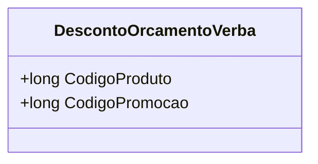

# DescontoOrcamentoVerba
**Namespace**: IsthmusWinthor.Dominio.Model.Verbas  
**Nome do Arquivo**: DescontoOrcamentoVerba.cs  

## Visão Geral e Responsabilidade
A classe `DescontoOrcamentoVerba` representa um desconto aplicado a um orçamento, vinculado a um produto específico e a uma campanha promocional. O objetivo dessa classe é encapsular as informações necessárias para identificar qual produto está sendo descontado e a qual campanha de promoção ele pertence. Isso é fundamental para garantir a correta aplicação de descontos nas transações de vendas, ajudando a manter a integridade das práticas promocionais dentro de um orçamento.

## Métodos de Negócio
A classe não possui métodos com lógica business específica além do construtor, que é responsável por inicializar os dados da classe.

## Propriedades Calculadas e de Validação
- **Nenhuma propriedade com lógica de cálculo ou validação definida.**

## Navigations Property
- **Nenhuma propriedade que seja uma classe complexa do domínio.**

## Tipos Auxiliares e Dependências
- **Nenhum tipo auxiliar, enumerador ou classe estática/helper utilizado.**

## Diagrama de Relacionamentos

---
Gerada em 29/12/2025 21:21:18
