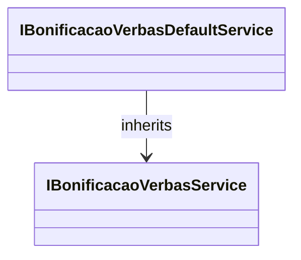

# IBonificacaoVerbasDefaultService
**Namespace**: IsthmusWinthor.Dominio.Model.Verbas.Interfaces.Bonificacoes  
**Nome do Arquivo**: IBonificacaoVerbasDefaultService.cs  

A interface `IBonificacaoVerbasDefaultService` define um contrato para serviços de bonificação referente às verbas, assegurando que as implementações de bonificação sigam as regras de negócio estabelecidas na interface base `IBonificacaoVerbasService`. Essa interface é crucial para garantir a consistência e integridade dos processos de bonificação em todo o sistema, permitindo que diferentes implementações possam ser utilizadas sem comprometer as regras de negócio.

## Métodos de Negócio
Como esta é uma interface, não há métodos de negócio definidos diretamente. Contudo, é esperado que as implementações forneçam métodos que garantirão regras específicas de bonificação conforme o contexto de uso das verbas.

## Propriedades Calculadas e de Validação
Como se trata de uma interface, não há propriedades calculadas ou de validação definidas.

## Navigation Property
Não existem propriedades de navegação específicas nesta interface, mas ela herda de `IBonificacaoVerbasService`, que pode incluir tais propriedades em suas implementações. Para detalhes sobre propriedades e métodos nesta interface mãe, é necessário consultar [IBonificacaoVerbasService](IBonificacaoVerbasService.md).

## Tipos Auxiliares e Dependências
- Esta interface depende da interface base `IBonificacaoVerbasService`. Para mais informações, veja [IBonificacaoVerbasService](IBonificacaoVerbasService.md).

## Diagrama de Relacionamentos

---
Gerada em 29/12/2025 21:23:45
