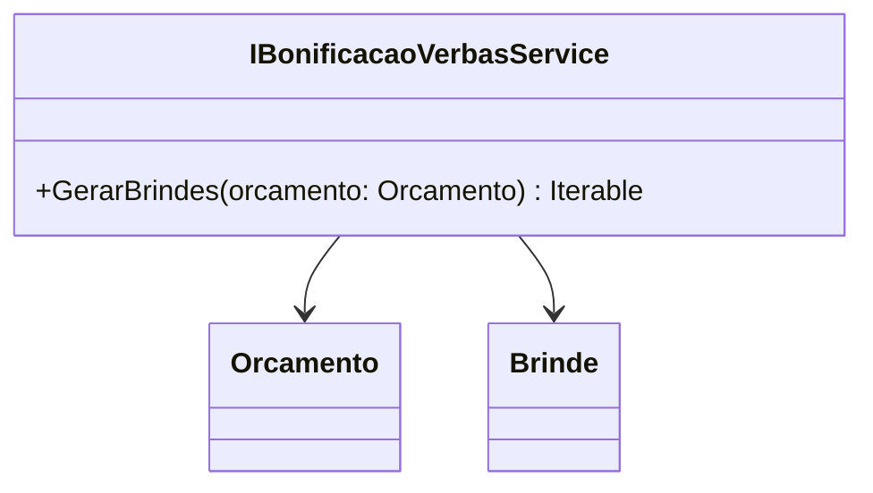

# IBonificacaoVerbasService
**Namespace**: IsthmusWinthor.Dominio.Model.Verbas.Interfaces.Bonificacoes  
**Nome do Arquivo**: IBonificacaoVerbasService.cs

### Visão Geral e Responsabilidade
A interface `IBonificacaoVerbasService` define um contrato para a geração de brindes associados a um orçamento. Ela permite a implementação da lógica de bonificação de forma a personalizar as ofertas aos clientes, contribuindo para o aumento das vendas e a fidelização de clientes. Este serviço é crucial em cenários de vendas onde a bonificação/agrado pode influenciar na decisão de compra do cliente.

### Métodos de Negócio

#### Título: `GerarBrindes` - Visibilidade: `public`
- **Objetivo**: Garante a geração apropriada de brindes com base nos dados fornecidos no orçamento.
- **Comportamento**: 
  1. Recebe um objeto do tipo `Orcamento` como parâmetro.
  2. Através da implementação concreta da interface, a lógica de seleção e criação dos brindes é executada com base nas regras de negócio definidas.
  3. Retorna uma coleção de objetos do tipo `Brinde` que foram gerados conforme as regras definidas (ex: valor do orçamento, itens comprados).

- **Retorno**: Uma coleção de `Brinde` que representa os brindes gerados para o orçamento especificado.

### Tipos Auxiliares e Dependências
- **Classes**:
  - [Orcamento](Orcamento.md) - Representa os dados do orçamento que influenciam na geração dos brindes.
  - [Brinde](Brinde.md) - Representa a estrutura do brinde que pode ser gerado.

### Diagrama de Relacionamentos

---
Gerada em 29/12/2025 21:23:56
